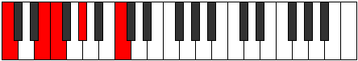

# Scale Aeoloric

## Links

- [Documentation](index.md)
- [Scales Index](Scales.md)
- [Modes Index](Modes.md)
- [Chords Index](Chords.md)

## Cardinality

4 Notes

## Perfection

- 1 Perfect Pitch
- 3 Imperfect Pitch
- [false false false true] Perfection Profile

## Modes

| Number | Mode | Notes | Illustration | Audio |
|--------|------|-------|--------------|-------|
| [275](https://ianring.com/musictheory/scales/275) | [Dalic](ModeDalic.md) | **C**, C#, **E**, **G#**, **C** |  | [midi](https://github.com/edipermadi/music/blob/main/docs/ModeCNaturalDalic.mid?raw=true) | 
| [305](https://ianring.com/musictheory/scales/305) | [Gonic](ModeGonic.md) | **C**, **E**, F, **G#**, **C** |  | [midi](https://github.com/edipermadi/music/blob/main/docs/ModeCNaturalGonic.mid?raw=true) | 
| [785](https://ianring.com/musictheory/scales/785) | [Aeoloric](ModeAeoloric.md) | **C**, **E**, **G#**, A, **C** |  | [midi](https://github.com/edipermadi/music/blob/main/docs/ModeCNaturalAeoloric.mid?raw=true) | 
| [2185](https://ianring.com/musictheory/scales/2185) | [Dygic](ModeDygic.md) | C, **D#**, **G**, **B**, C |  | [midi](https://github.com/edipermadi/music/blob/main/docs/ModeCNaturalDygic.mid?raw=true) | 
