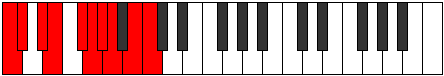

# Scale Aeolorygic

## Links

- [Documentation](index.md)
- [Scales Index](Scales.md)
- [Modes Index](Modes.md)
- [Chords Index](Chords.md)

## Cardinality

9 Notes

## Perfection

- 7 Perfect Pitch
- 2 Imperfect Pitch
- [true false true true false true true true true] Perfection Profile

## Modes

| Number | Mode | Notes | Illustration | Audio |
|--------|------|-------|--------------|-------|
| [1775](https://ianring.com/musictheory/scales/1775) | [Lyrygic](ModeLyrygic.md) | C, **C#**, D, D#, F, F#, G, **A**, A#, C |  | [midi](ModeCNaturalLyrygic.mid) [ogg](ModeCNaturalLyrygic.ogg) | 
| [1915](https://ianring.com/musictheory/scales/1915) | [Thydygic](ModeThydygic.md) | **C**, C#, D#, **E**, F, F#, G#, A, A#, **C** |  | [midi](ModeCNaturalThydygic.mid) [ogg](ModeCNaturalThydygic.ogg) | 
| [1975](https://ianring.com/musictheory/scales/1975) | [Ionocrygic](ModeIonocrygic.md) | C, C#, D, **E**, F, G, **G#**, A, A#, C |  | [midi](ModeCNaturalIonocrygic.mid) [ogg](ModeCNaturalIonocrygic.ogg) | 
| [2935](https://ianring.com/musictheory/scales/2935) | [Modygic](ModeModygic.md) | **C**, C#, D, E, F, F#, **G#**, A, B, **C** |  | [midi](ModeCNaturalModygic.mid) [ogg](ModeCNaturalModygic.ogg) | 
| [3005](https://ianring.com/musictheory/scales/3005) | [Gycrygic](ModeGycrygic.md) | C, D, **D#**, E, F, G, G#, A, **B**, C |  | [midi](ModeCNaturalGycrygic.mid) [ogg](ModeCNaturalGycrygic.ogg) | 
| [3035](https://ianring.com/musictheory/scales/3035) | [Gocrygic](ModeGocrygic.md) | C, C#, **D#**, E, F#, **G**, G#, A, B, C |  | [midi](ModeCNaturalGocrygic.mid) [ogg](ModeCNaturalGocrygic.ogg) | 
| [3515](https://ianring.com/musictheory/scales/3515) | [Katodygic](ModeKatodygic.md) | C, C#, D#, E, F, **G**, G#, A#, **B**, C |  | [midi](ModeCNaturalKatodygic.mid) [ogg](ModeCNaturalKatodygic.ogg) | 
| [3565](https://ianring.com/musictheory/scales/3565) | [Aeolorygic](ModeAeolorygic.md) | C, **D**, D#, F, **F#**, G, G#, A#, B, C |  | [midi](ModeCNaturalAeolorygic.mid) [ogg](ModeCNaturalAeolorygic.ogg) | 
| [3805](https://ianring.com/musictheory/scales/3805) | [Moptygic](ModeMoptygic.md) | C, D, D#, E, **F#**, G, A, **A#**, B, C |  | [midi](ModeCNaturalMoptygic.mid) [ogg](ModeCNaturalMoptygic.ogg) | 
