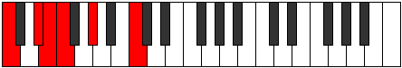

# Scale Aeolyritonic

## Links

- [Documentation](index.md)
- [Scales Index](Scales.md)
- [Modes Index](Modes.md)
- [Chords Index](Chords.md)

## Cardinality

5 Notes

## Perfection

- 2 Perfect Pitch
- 3 Imperfect Pitch
- [true false false false true] Perfection Profile

## Modes

| Number | Mode | Notes | Illustration | Audio |
|--------|------|-------|--------------|-------|
| [313](https://ianring.com/musictheory/scales/313) | [Goritonic](ModeGoritonic.md) | **C**, **D#**, **E**, F, G#, **C** |  | [midi](https://github.com/edipermadi/music/blob/main/docs/ModeCNaturalGoritonic.mid?raw=true) | 
| [551](https://ianring.com/musictheory/scales/551) | [Aeoloditonic](ModeAeoloditonic.md) | **C**, **C#**, D, F, **A**, **C** |  | [midi](https://github.com/edipermadi/music/blob/main/docs/ModeCNaturalAeoloditonic.mid?raw=true) | 
| [913](https://ianring.com/musictheory/scales/913) | [Aeolyritonic](ModeAeolyritonic.md) | C, **E**, **G**, **G#**, A, C |  | [midi](https://github.com/edipermadi/music/blob/main/docs/ModeCNaturalAeolyritonic.mid?raw=true) | 
| [2323](https://ianring.com/musictheory/scales/2323) | [Doptitonic](ModeDoptitonic.md) | **C**, C#, E, **G#**, **B**, **C** |  | [midi](https://github.com/edipermadi/music/blob/main/docs/ModeCNaturalDoptitonic.mid?raw=true) | 
| [3209](https://ianring.com/musictheory/scales/3209) | [Aeraphitonic](ModeAeraphitonic.md) | C, D#, **G**, **A#**, **B**, C |  | [midi](https://github.com/edipermadi/music/blob/main/docs/ModeCNaturalAeraphitonic.mid?raw=true) | 
