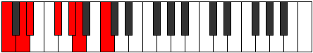

# Scale Aeradimic

## Links

- [Documentation](index.md)
- [Scales Index](Scales.md)
- [Modes Index](Modes.md)
- [Chords Index](Chords.md)

## Cardinality

6 Notes

## Perfection

- 2 Perfect Pitch
- 4 Imperfect Pitch
- [false false true false false true] Perfection Profile

## Modes

| Number | Mode | Notes | Illustration | Audio |
|--------|------|-------|--------------|-------|
| [845](https://ianring.com/musictheory/scales/845) | [Zyrimic](ModeZyrimic.md) | **C**, D, **Eb**, **F#**, G#, **A**, **C** |  | [midi](ModeCNaturalZyrimic.mid) [ogg](ModeCNaturalZyrimic.ogg) | 
| [1235](https://ianring.com/musictheory/scales/1235) | [Stylimic](ModeStylimic.md) | C, **Db**, **E**, F#, **G**, **A#**, C |  | [midi](ModeCNaturalStylimic.mid) [ogg](ModeCNaturalStylimic.ogg) | 
| [2665](https://ianring.com/musictheory/scales/2665) | [Aeradimic](ModeAeradimic.md) | **C**, **D#**, E#, **F#**, **G##**, A##, **C** |  | [midi](ModeCNaturalAeradimic.mid) [ogg](ModeCNaturalAeradimic.ogg) | 
