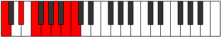

# Scale Aeragimic

## Links

- [Documentation](index.md)
- [Scales Index](Scales.md)
- [Modes Index](Modes.md)
- [Chords Index](Chords.md)

## Cardinality

6 Notes

## Perfection

- 2 Perfect Pitch
- 4 Imperfect Pitch
- [true false true false false false] Perfection Profile

## Modes

| Number | Mode | Notes | Illustration | Audio |
|--------|------|-------|--------------|-------|
| [853](https://ianring.com/musictheory/scales/853) | [Epothimic](ModeEpothimic.md) | **C**, D, **E**, **F#**, **G#**, A, **C** |  | [midi](ModeCNaturalEpothimic.mid) [ogg](ModeCNaturalEpothimic.ogg) | 
| [1237](https://ianring.com/musictheory/scales/1237) | [Salimic](ModeSalimic.md) | C, **D**, **E**, **F#**, G, **A#**, C |  | [midi](ModeCNaturalSalimic.mid) [ogg](ModeCNaturalSalimic.ogg) | 
| [1333](https://ianring.com/musictheory/scales/1333) | [Lyptimic](ModeLyptimic.md) | **C**, **D**, **E**, F, **G#**, A#, **C** |  | [midi](ModeCNaturalLyptimic.mid) [ogg](ModeCNaturalLyptimic.ogg) | 
| [1357](https://ianring.com/musictheory/scales/1357) | [Katonimic](ModeKatonimic.md) | **C**, **D**, Eb, **F#**, G#, **A#**, **C** |  | [midi](ModeCNaturalKatonimic.mid) [ogg](ModeCNaturalKatonimic.ogg) | 
| [1363](https://ianring.com/musictheory/scales/1363) | [Gygimic](ModeGygimic.md) | **C**, Db, **E**, F#, **G#**, **A#**, **C** |  | [midi](ModeCNaturalGygimic.mid) [ogg](ModeCNaturalGygimic.ogg) | 
| [2729](https://ianring.com/musictheory/scales/2729) | [Aeragimic](ModeAeragimic.md) | C, **D#**, E#, **F##**, **G##**, **A##**, C |  | [midi](ModeCNaturalAeragimic.mid) [ogg](ModeCNaturalAeragimic.ogg) | 
