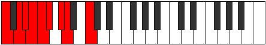

# Scale Aeronyllic

## Links

- [Documentation](README.md)
- [Scales Index](Scales.md)
- [Modes Index](Modes.md)
- [Chords Index](Chords.md)

## Cardinality

8 Notes

## Perfection

- 4 Perfect Pitch
- 4 Imperfect Pitch
- [true false true false false true false true] Perfection Profile

## Modes

| Number | Mode | Notes | Illustration | Audio |
|--------|------|-------|--------------|-------|
| [893](https://ianring.com/musictheory/scales/893) | [Pycryllic](ModePycryllic.md) | **C**, D, **D#**, **E**, F, **F#**, G#, A, **C** |  | [midi](https://github.com/edipermadi/music/blob/main/docs/ModeCNaturalPycryllic.mid?raw=true) | 
| [1247](https://ianring.com/musictheory/scales/1247) | [Mygyllic](ModeMygyllic.md) | C, **C#**, **D**, D#, **E**, F#, G, **A#**, C |  | [midi](https://github.com/edipermadi/music/blob/main/docs/ModeCNaturalMygyllic.mid?raw=true) | 
| [2003](https://ianring.com/musictheory/scales/2003) | [Lolyllic](ModeLolyllic.md) | C, C#, **E**, F#, **G**, **G#**, A, **A#**, C |  | [midi](https://github.com/edipermadi/music/blob/main/docs/ModeCNaturalLolyllic.mid?raw=true) | 
| [2671](https://ianring.com/musictheory/scales/2671) | [Lylyllic](ModeLylyllic.md) | **C**, **C#**, D, **D#**, F, F#, **A**, B, **C** |  | [midi](https://github.com/edipermadi/music/blob/main/docs/ModeCNaturalLylyllic.mid?raw=true) | 
| [3049](https://ianring.com/musictheory/scales/3049) | [Aeronyllic](ModeAeronyllic.md) | C, **D#**, F, **F#**, **G**, G#, **A**, B, C |  | [midi](https://github.com/edipermadi/music/blob/main/docs/ModeCNaturalAeronyllic.mid?raw=true) | 
| [3383](https://ianring.com/musictheory/scales/3383) | [Daptyllic](ModeDaptyllic.md) | **C**, C#, **D**, E, F, **G#**, A#, **B**, **C** |  | [midi](https://github.com/edipermadi/music/blob/main/docs/ModeCNaturalDaptyllic.mid?raw=true) | 
| [3739](https://ianring.com/musictheory/scales/3739) | [Ioninyllic](ModeIoninyllic.md) | C, **C#**, D#, E, **G**, A, **A#**, **B**, C |  | [midi](https://github.com/edipermadi/music/blob/main/docs/ModeCNaturalIoninyllic.mid?raw=true) | 
| [3917](https://ianring.com/musictheory/scales/3917) | [Epaphyllic](ModeEpaphyllic.md) | **C**, D, D#, **F#**, G#, **A**, **A#**, B, **C** |  | [midi](https://github.com/edipermadi/music/blob/main/docs/ModeCNaturalEpaphyllic.mid?raw=true) | 
