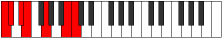

# Scale Aerothimic

## Links

- [Documentation](README.md)
- [Scales Index](Scales.md)
- [Modes Index](Modes.md)
- [Chords Index](Chords.md)

## Cardinality

6 Notes

## Perfection

- 2 Perfect Pitch
- 4 Imperfect Pitch
- [false false true false false true] Perfection Profile

## Modes

| Number | Mode | Notes | Illustration | Audio |
|--------|------|-------|--------------|-------|
| [311](https://ianring.com/musictheory/scales/311) | [Stagimic](ModeStagimic.md) | **C**, Db, **Ebb**, **Fb**, Gbb, **Ab**, **C** |  | [midi](https://github.com/edipermadi/music/blob/main/docs/ModeCNaturalStagimic.mid?raw=true) | 
| [881](https://ianring.com/musictheory/scales/881) | [Aerothimic](ModeAerothimic.md) | **C**, **D##**, E#, **F#**, **G#**, A, **C** |  | [midi](https://github.com/edipermadi/music/blob/main/docs/ModeCNaturalAerothimic.mid?raw=true) | 
| [1811](https://ianring.com/musictheory/scales/1811) | [Kyptimic](ModeKyptimic.md) | **C**, Db, **E**, **F###**, G##, **A#**, **C** |  | [midi](https://github.com/edipermadi/music/blob/main/docs/ModeCNaturalKyptimic.mid?raw=true) | 
| [2203](https://ianring.com/musictheory/scales/2203) | [Dorimic](ModeDorimic.md) | C, **Db**, **Eb**, Fb, **G**, **A##**, C |  | [midi](https://github.com/edipermadi/music/blob/main/docs/ModeCNaturalDorimic.mid?raw=true) | 
| [2953](https://ianring.com/musictheory/scales/2953) | [Ionylimic](ModeIonylimic.md) | C, **D#**, **E###**, F###, **G##**, **A##**, C |  | [midi](https://github.com/edipermadi/music/blob/main/docs/ModeCNaturalIonylimic.mid?raw=true) | 
| [3149](https://ianring.com/musictheory/scales/3149) | [Phrycrimic](ModePhrycrimic.md) | **C**, **D**, Eb, **F#**, **G###**, A##, **C** |  | [midi](https://github.com/edipermadi/music/blob/main/docs/ModeCNaturalPhrycrimic.mid?raw=true) | 
