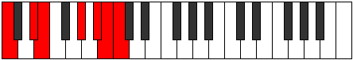

# Scale Aerycrimic

## Links

- [Documentation](index.md)
- [Scales Index](Scales.md)
- [Modes Index](Modes.md)
- [Chords Index](Chords.md)

## Cardinality

6 Notes

## Perfection

- 3 Perfect Pitch
- 3 Imperfect Pitch
- [true true false false false true] Perfection Profile

## Modes

| Number | Mode | Notes | Illustration | Audio |
|--------|------|-------|--------------|-------|
| [413](https://ianring.com/musictheory/scales/413) | [Ganimic](ModeGanimic.md) | C, **D**, **Eb**, **Fb**, G, Ab, C |  | [midi](ModeCNaturalGanimic.mid) [ogg](ModeCNaturalGanimic.ogg) | 
| [931](https://ianring.com/musictheory/scales/931) | [Bacrimic](ModeBacrimic.md) | C, Db, E#, **F##**, **G#**, **A**, C |  | [midi](ModeCNaturalBacrimic.mid) [ogg](ModeCNaturalBacrimic.ogg) | 
| [1127](https://ianring.com/musictheory/scales/1127) | [Eparimic](ModeEparimic.md) | **C**, **Db**, **Ebb**, F, Gb, A#, **C** |  | [midi](ModeCNaturalEparimic.mid) [ogg](ModeCNaturalEparimic.ogg) | 
| [2513](https://ianring.com/musictheory/scales/2513) | [Aerycrimic](ModeAerycrimic.md) | C, D##, **E##**, **F##**, **G#**, A##, C |  | [midi](ModeCNaturalAerycrimic.mid) [ogg](ModeCNaturalAerycrimic.ogg) | 
| [2611](https://ianring.com/musictheory/scales/2611) | [Lyrimic](ModeLyrimic.md) | **C**, **Db**, E, F, G##, **A##**, **C** |  | [midi](ModeCNaturalLyrimic.mid) [ogg](ModeCNaturalLyrimic.ogg) | 
| [3353](https://ianring.com/musictheory/scales/3353) | [Phraptimic](ModePhraptimic.md) | **C**, D#, E, F###, **G###**, **A##**, **C** |  | [midi](ModeCNaturalPhraptimic.mid) [ogg](ModeCNaturalPhraptimic.ogg) | 
