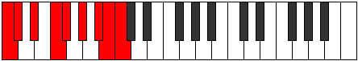

# Scale Aerycryllic

## Links

- [Documentation](index.md)
- [Scales Index](Scales.md)
- [Modes Index](Modes.md)
- [Chords Index](Chords.md)

## Cardinality

8 Notes

## Perfection

- 7 Perfect Pitch
- 1 Imperfect Pitch
- [true true true true true true true false] Perfection Profile

## Modes

| Number | Mode | Notes | Illustration | Audio |
|--------|------|-------|--------------|-------|
| [1455](https://ianring.com/musictheory/scales/1455) | [Soryllic](ModeSoryllic.md) | C, C#, **D**, D#, F, G, G#, A#, C |  | [midi](ModeCNaturalSoryllic.mid) [ogg](ModeCNaturalSoryllic.ogg) | 
| [1515](https://ianring.com/musictheory/scales/1515) | [Solyllic](ModeSolyllic.md) | C, C#, D#, F, F#, **G**, G#, A#, C |  | [midi](ModeCNaturalSolyllic.mid) [ogg](ModeCNaturalSolyllic.ogg) | 
| [1725](https://ianring.com/musictheory/scales/1725) | [Mixodyllic](ModeMixodyllic.md) | C, D, D#, **E**, F, G, A, A#, C |  | [midi](ModeCNaturalMixodyllic.mid) [ogg](ModeCNaturalMixodyllic.ogg) | 
| [1965](https://ianring.com/musictheory/scales/1965) | [Gadyllic](ModeGadyllic.md) | C, D, D#, F, G, G#, **A**, A#, C |  | [midi](ModeCNaturalGadyllic.mid) [ogg](ModeCNaturalGadyllic.ogg) | 
| [2775](https://ianring.com/musictheory/scales/2775) | [Godyllic](ModeGodyllic.md) | C, **C#**, D, E, F#, G, A, B, C |  | [midi](ModeCNaturalGodyllic.mid) [ogg](ModeCNaturalGodyllic.ogg) | 
| [2805](https://ianring.com/musictheory/scales/2805) | [Zylyllic](ModeZylyllic.md) | C, D, E, F, **F#**, G, A, B, C |  | [midi](ModeCNaturalZylyllic.mid) [ogg](ModeCNaturalZylyllic.ogg) | 
| [3435](https://ianring.com/musictheory/scales/3435) | [Epiphyllic](ModeEpiphyllic.md) | **C**, C#, D#, F, F#, G#, A#, B, **C** |  | [midi](ModeCNaturalEpiphyllic.mid) [ogg](ModeCNaturalEpiphyllic.ogg) | 
| [3765](https://ianring.com/musictheory/scales/3765) | [Aerycryllic](ModeAerycryllic.md) | C, D, E, F, G, A, A#, **B**, C |  | [midi](ModeCNaturalAerycryllic.mid) [ogg](ModeCNaturalAerycryllic.ogg) | 
