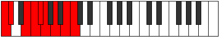

# Scale Bacryllic

## Links

- [Documentation](index.md)
- [Scales Index](Scales.md)
- [Modes Index](Modes.md)
- [Chords Index](Chords.md)

## Cardinality

8 Notes

## Perfection

- 6 Perfect Pitch
- 2 Imperfect Pitch
- [false true true true false true true true] Perfection Profile

## Modes

| Number | Mode | Notes | Illustration | Audio |
|--------|------|-------|--------------|-------|
| [943](https://ianring.com/musictheory/scales/943) | [Aerygyllic](ModeAerygyllic.md) | C, C#, D, **D#**, F, G, G#, **A**, C |  | [midi](ModeCNaturalAerygyllic.mid) [ogg](ModeCNaturalAerygyllic.ogg) | 
| [1511](https://ianring.com/musictheory/scales/1511) | [Styptyllic](ModeStyptyllic.md) | C, C#, **D**, F, F#, G, **G#**, A#, C |  | [midi](ModeCNaturalStyptyllic.mid) [ogg](ModeCNaturalStyptyllic.ogg) | 
| [1949](https://ianring.com/musictheory/scales/1949) | [Mathyllic](ModeMathyllic.md) | C, D, D#, **E**, G, G#, A, **A#**, C |  | [midi](ModeCNaturalMathyllic.mid) [ogg](ModeCNaturalMathyllic.ogg) | 
| [2519](https://ianring.com/musictheory/scales/2519) | [Dathyllic](ModeDathyllic.md) | C, C#, **D**, E, F#, G, **G#**, B, C |  | [midi](ModeCNaturalDathyllic.mid) [ogg](ModeCNaturalDathyllic.ogg) | 
| [2803](https://ianring.com/musictheory/scales/2803) | [Zolyllic](ModeZolyllic.md) | C, **C#**, E, F, F#, **G**, A, B, C |  | [midi](ModeCNaturalZolyllic.mid) [ogg](ModeCNaturalZolyllic.ogg) | 
| [3307](https://ianring.com/musictheory/scales/3307) | [Boptyllic](ModeBoptyllic.md) | C, **C#**, D#, F, F#, **G**, A#, B, C |  | [midi](ModeCNaturalBoptyllic.mid) [ogg](ModeCNaturalBoptyllic.ogg) | 
| [3449](https://ianring.com/musictheory/scales/3449) | [Bacryllic](ModeBacryllic.md) | **C**, D#, E, F, **F#**, G#, A#, B, **C** |  | [midi](ModeCNaturalBacryllic.mid) [ogg](ModeCNaturalBacryllic.ogg) | 
| [3701](https://ianring.com/musictheory/scales/3701) | [Bagyllic](ModeBagyllic.md) | **C**, D, E, F, **F#**, A, A#, B, **C** |  | [midi](ModeCNaturalBagyllic.mid) [ogg](ModeCNaturalBagyllic.ogg) | 
