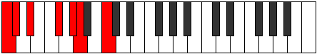

# Scale Bocrimic

## Links

- [Documentation](README.md)
- [Scales Index](Scales.md)
- [Modes Index](Modes.md)
- [Chords Index](Chords.md)

## Cardinality

6 Notes

## Perfection

- 3 Perfect Pitch
- 3 Imperfect Pitch
Perfection Profile - false, true, true, false, false, true

## Modes

| Number | Mode | Luminosity | Notes | Illustration | Audio |
|--------|------|------------|-------|--------------|-------|
| [717](https://ianring.com/musictheory/scales/717) | [Gythimic](ModeGythimic.md) | 6 | C, D, **Eb**, **F#**, G, **A**, C |  | [midi](https://github.com/edipermadi/music/blob/main/docs/ModeCNaturalGythimic.mid?raw=true) | 
| [843](https://ianring.com/musictheory/scales/843) | [Molimic](ModeMolimic.md) | -1 | **C**, Db, **Eb**, F#, G#, **A**, **C** |  | [midi](https://github.com/edipermadi/music/blob/main/docs/ModeCNaturalMolimic.mid?raw=true) | 
| [1203](https://ianring.com/musictheory/scales/1203) | [Pagimic](ModePagimic.md) | 4 | C, **Db**, **E**, F, **G**, A#, C |  | [midi](https://github.com/edipermadi/music/blob/main/docs/ModeCNaturalPagimic.mid?raw=true) | 
| [1641](https://ianring.com/musictheory/scales/1641) | [Bocrimic](ModeBocrimic.md) | 3 | **C**, D#, E#, **F#**, **G##**, A#, **C** |  | [midi](https://github.com/edipermadi/music/blob/main/docs/ModeCNaturalBocrimic.mid?raw=true) | 
| [2469](https://ianring.com/musictheory/scales/2469) | [Staptimic](ModeStaptimic.md) | 5 | C, **D**, E#, F##, **G#**, **A##**, C |  | [midi](https://github.com/edipermadi/music/blob/main/docs/ModeCNaturalStaptimic.mid?raw=true) | 
| [2649](https://ianring.com/musictheory/scales/2649) | [Aeolythimic](ModeAeolythimic.md) | -1 | **C**, **D#**, E, **F#**, G##, A##, **C** |  | [midi](https://github.com/edipermadi/music/blob/main/docs/ModeCNaturalAeolythimic.mid?raw=true) | 
