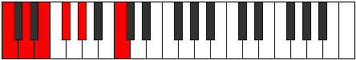

# Scale Bolitonic

## Links

- [Documentation](index.md)
- [Scales Index](Scales.md)
- [Modes Index](Modes.md)
- [Chords Index](Chords.md)

## Cardinality

5 Notes

## Perfection

- 0 Perfect Pitch
- 5 Imperfect Pitch
- [false false false false false] Perfection Profile

## Modes

| Number | Mode | Notes | Illustration | Audio |
|--------|------|-------|--------------|-------|
| [341](https://ianring.com/musictheory/scales/341) | [Bothitonic](ModeBothitonic.md) | **C**, **D**, **E**, **F#**, **G#**, **C** |  | [midi](https://github.com/edipermadi/music/blob/main/docs/ModeCNaturalBothitonic.mid?raw=true) | 
| [1109](https://ianring.com/musictheory/scales/1109) | [Kataditonic](ModeKataditonic.md) | **C**, **D**, **E**, **F#**, **A#**, **C** |  | [midi](https://github.com/edipermadi/music/blob/main/docs/ModeCNaturalKataditonic.mid?raw=true) | 
| [1301](https://ianring.com/musictheory/scales/1301) | [Koditonic](ModeKoditonic.md) | **C**, **D**, **E**, **G#**, **A#**, **C** |  | [midi](https://github.com/edipermadi/music/blob/main/docs/ModeCNaturalKoditonic.mid?raw=true) | 
| [1349](https://ianring.com/musictheory/scales/1349) | [Tholitonic](ModeTholitonic.md) | **C**, **D**, **F#**, **G#**, **A#**, **C** |  | [midi](https://github.com/edipermadi/music/blob/main/docs/ModeCNaturalTholitonic.mid?raw=true) | 
| [1361](https://ianring.com/musictheory/scales/1361) | [Bolitonic](ModeBolitonic.md) | **C**, **E**, **F#**, **G#**, **A#**, **C** |  | [midi](https://github.com/edipermadi/music/blob/main/docs/ModeCNaturalBolitonic.mid?raw=true) | 
