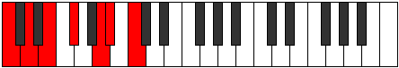

# Scale Boptimic

## Links

- [Documentation](index.md)
- [Scales Index](Scales.md)
- [Modes Index](Modes.md)
- [Chords Index](Chords.md)

## Cardinality

6 Notes

## Perfection

- 2 Perfect Pitch
- 4 Imperfect Pitch
- [false true false false true false] Perfection Profile

## Modes

| Number | Mode | Notes | Illustration | Audio |
|--------|------|-------|--------------|-------|
| [683](https://ianring.com/musictheory/scales/683) | [Stogimic](ModeStogimic.md) | C, **Db**, **Eb**, F, **G**, **A**, C |  | [midi](ModeCNaturalStogimic.mid) [ogg](ModeCNaturalStogimic.ogg) | 
| [1369](https://ianring.com/musictheory/scales/1369) | [Boptimic](ModeBoptimic.md) | **C**, D#, **E**, **F#**, G#, **A#**, **C** |  | [midi](ModeCNaturalBoptimic.mid) [ogg](ModeCNaturalBoptimic.ogg) | 
| [1381](https://ianring.com/musictheory/scales/1381) | [Padimic](ModePadimic.md) | **C**, **D**, E#, **F#**, **G#**, A#, **C** |  | [midi](ModeCNaturalPadimic.mid) [ogg](ModeCNaturalPadimic.ogg) | 
| [1429](https://ianring.com/musictheory/scales/1429) | [Bythimic](ModeBythimic.md) | C, **D**, **E**, F##, **G#**, **A#**, C |  | [midi](ModeCNaturalBythimic.mid) [ogg](ModeCNaturalBythimic.ogg) | 
| [1621](https://ianring.com/musictheory/scales/1621) | [Aeolathimic](ModeAeolathimic.md) | **C**, D, **E**, **F#**, G##, **A#**, **C** |  | [midi](ModeCNaturalAeolathimic.mid) [ogg](ModeCNaturalAeolathimic.ogg) | 
| [2389](https://ianring.com/musictheory/scales/2389) | [Thynimic](ModeThynimic.md) | **C**, **D**, E, **F#**, **G#**, A##, **C** |  | [midi](ModeCNaturalThynimic.mid) [ogg](ModeCNaturalThynimic.ogg) | 
