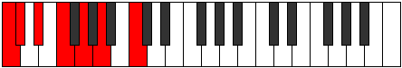

# Scale Boptimic

## Links

- [Documentation](README.md)
- [Scales Index](Scales.md)
- [Modes Index](Modes.md)
- [Chords Index](Chords.md)

## Cardinality

6 Notes

## Perfection

- 2 Perfect Pitch
- 4 Imperfect Pitch
Perfection Profile - false, true, false, false, true, false

## Modes

| Number | Mode | Luminosity | Notes | Illustration | Audio |
|--------|------|------------|-------|--------------|-------|
| [683](https://ianring.com/musictheory/scales/683) | [Stogimic](ModeStogimic.md) | 5 | C, **Db**, **Eb**, F, **G**, **A**, C |  | [midi](https://github.com/edipermadi/music/blob/main/docs/ModeCNaturalStogimic.mid?raw=true) | 
| [1369](https://ianring.com/musictheory/scales/1369) | [Boptimic](ModeBoptimic.md) | -1 | **C**, D#, **E**, **F#**, G#, **A#**, **C** |  | [midi](https://github.com/edipermadi/music/blob/main/docs/ModeCNaturalBoptimic.mid?raw=true) | 
| [1381](https://ianring.com/musictheory/scales/1381) | [Padimic](ModePadimic.md) | 4 | **C**, **D**, E#, **F#**, **G#**, A#, **C** |  | [midi](https://github.com/edipermadi/music/blob/main/docs/ModeCNaturalPadimic.mid?raw=true) | 
| [1429](https://ianring.com/musictheory/scales/1429) | [Bythimic](ModeBythimic.md) | 6 | C, **D**, **E**, F##, **G#**, **A#**, C |  | [midi](https://github.com/edipermadi/music/blob/main/docs/ModeCNaturalBythimic.mid?raw=true) | 
| [1621](https://ianring.com/musictheory/scales/1621) | [Aeolathimic](ModeAeolathimic.md) | -1 | **C**, D, **E**, **F#**, G##, **A#**, **C** |  | [midi](https://github.com/edipermadi/music/blob/main/docs/ModeCNaturalAeolathimic.mid?raw=true) | 
| [2389](https://ianring.com/musictheory/scales/2389) | [Thynimic](ModeThynimic.md) | -1 | **C**, **D**, E, **F#**, **G#**, A##, **C** |  | [midi](https://github.com/edipermadi/music/blob/main/docs/ModeCNaturalThynimic.mid?raw=true) | 
