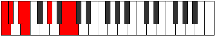

# Scale Bygimic

## Links

- [Documentation](README.md)
- [Scales Index](Scales.md)
- [Modes Index](Modes.md)
- [Chords Index](Chords.md)

## Cardinality

6 Notes

## Perfection

- 3 Perfect Pitch
- 3 Imperfect Pitch
Perfection Profile - true, true, false, false, true, false

## Modes

| Number | Mode | Luminosity | Notes | Illustration | Audio |
|--------|------|------------|-------|--------------|-------|
| [441](https://ianring.com/musictheory/scales/441) | [Thycrimic](ModeThycrimic.md) | -1 | C, **D#**, **E**, F, **G**, Ab, C |  | [midi](https://github.com/edipermadi/music/blob/main/docs/ModeCNaturalThycrimic.mid?raw=true) | 
| [567](https://ianring.com/musictheory/scales/567) | [Aeoladimic](ModeAeoladimic.md) | 5 | **C**, **Db**, Ebb, **Fb**, Gbb, A, **C** |  | [midi](https://github.com/edipermadi/music/blob/main/docs/ModeCNaturalAeoladimic.mid?raw=true) | 
| [1827](https://ianring.com/musictheory/scales/1827) | [Katygimic](ModeKatygimic.md) | -1 | **C**, Db, E#, **F###**, **G##**, A#, **C** |  | [midi](https://github.com/edipermadi/music/blob/main/docs/ModeCNaturalKatygimic.mid?raw=true) | 
| [2331](https://ianring.com/musictheory/scales/2331) | [Dylimic](ModeDylimic.md) | -1 | **C**, Db, **Eb**, Fb, G#, **A##**, **C** |  | [midi](https://github.com/edipermadi/music/blob/main/docs/ModeCNaturalDylimic.mid?raw=true) | 
| [2961](https://ianring.com/musictheory/scales/2961) | [Bygimic](ModeBygimic.md) | 6 | C, D##, **E###**, **F###**, G##, **A##**, C |  | [midi](https://github.com/edipermadi/music/blob/main/docs/ModeCNaturalBygimic.mid?raw=true) | 
| [3213](https://ianring.com/musictheory/scales/3213) | [Eponimic](ModeEponimic.md) | 6 | C, **D**, Eb, F##, **G###**, **A##**, C |  | [midi](https://github.com/edipermadi/music/blob/main/docs/ModeCNaturalEponimic.mid?raw=true) | 
