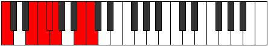

# Scale Daptimic

## Links

- [Documentation](README.md)
- [Scales Index](Scales.md)
- [Modes Index](Modes.md)
- [Chords Index](Chords.md)

## Cardinality

6 Notes

## Perfection

- 4 Perfect Pitch
- 2 Imperfect Pitch
Perfection Profile - false, true, true, true, true, false

## Modes

| Number | Mode | Luminosity | Notes | Illustration | Audio |
|--------|------|------------|-------|--------------|-------|
| [399](https://ianring.com/musictheory/scales/399) | [Zynimic](ModeZynimic.md) | 6 | C, Db, **Ebb**, **Fbb**, G, Ab, C |  | [midi](https://github.com/edipermadi/music/blob/main/docs/ModeCNaturalZynimic.mid?raw=true) | 
| [483](https://ianring.com/musictheory/scales/483) | [Kygimic](ModeKygimic.md) | -1 | C, Db, E#, F#, **G**, **Ab**, C |  | [midi](https://github.com/edipermadi/music/blob/main/docs/ModeCNaturalKygimic.mid?raw=true) | 
| [2247](https://ianring.com/musictheory/scales/2247) | [Aeolimic](ModeAeolimic.md) | -1 | C, **Db**, **Ebb**, F#, G, A##, C |  | [midi](https://github.com/edipermadi/music/blob/main/docs/ModeCNaturalAeolimic.mid?raw=true) | 
| [2289](https://ianring.com/musictheory/scales/2289) | [Mocrimic](ModeMocrimic.md) | -1 | C, D##, E#, **F#**, **G**, A##, C |  | [midi](https://github.com/edipermadi/music/blob/main/docs/ModeCNaturalMocrimic.mid?raw=true) | 
| [3171](https://ianring.com/musictheory/scales/3171) | [Zythimic](ModeZythimic.md) | -1 | **C**, **Db**, E#, F#, G###, A##, **C** |  | [midi](https://github.com/edipermadi/music/blob/main/docs/ModeCNaturalZythimic.mid?raw=true) | 
| [3633](https://ianring.com/musictheory/scales/3633) | [Daptimic](ModeDaptimic.md) | 4 | **C**, D##, E#, Cbbb, Cbb, **Dbbb**, **C** |  | [midi](https://github.com/edipermadi/music/blob/main/docs/ModeCNaturalDaptimic.mid?raw=true) | 
