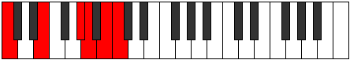

# Scale Dolitonic

## Links

- [Documentation](index.md)
- [Scales Index](Scales.md)
- [Modes Index](Modes.md)
- [Chords Index](Chords.md)

## Cardinality

5 Notes

## Perfection

- 2 Perfect Pitch
- 3 Imperfect Pitch
- [false true false true false] Perfection Profile

## Modes

| Number | Mode | Notes | Illustration | Audio |
|--------|------|-------|--------------|-------|
| [283](https://ianring.com/musictheory/scales/283) | [Aerylitonic](ModeAerylitonic.md) | **C**, C#, **D#**, **E**, G#, **C** |  | [midi](ModeCNaturalAerylitonic.mid) [ogg](ModeCNaturalAerylitonic.ogg) | 
| [433](https://ianring.com/musictheory/scales/433) | [Poritonic](ModePoritonic.md) | C, **E**, F, **G**, **G#**, C |  | [midi](ModeCNaturalPoritonic.mid) [ogg](ModeCNaturalPoritonic.ogg) | 
| [1571](https://ianring.com/musictheory/scales/1571) | [Lagitonic](ModeLagitonic.md) | **C**, **C#**, F, **A**, A#, **C** |  | [midi](ModeCNaturalLagitonic.mid) [ogg](ModeCNaturalLagitonic.ogg) | 
| [2189](https://ianring.com/musictheory/scales/2189) | [Zagitonic](ModeZagitonic.md) | C, **D**, **D#**, G, **B**, C |  | [midi](ModeCNaturalZagitonic.mid) [ogg](ModeCNaturalZagitonic.ogg) | 
| [2833](https://ianring.com/musictheory/scales/2833) | [Dolitonic](ModeDolitonic.md) | **C**, E, **G#**, A, **B**, **C** |  | [midi](ModeCNaturalDolitonic.mid) [ogg](ModeCNaturalDolitonic.ogg) | 
