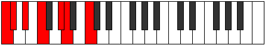
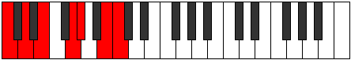

# Scale Dynimic

## Links

- [Documentation](README.md)
- [Scales Index](Scales.md)
- [Modes Index](Modes.md)
- [Chords Index](Chords.md)

## Cardinality

6 Notes

## Perfection

- 3 Perfect Pitch
- 3 Imperfect Pitch
Perfection Profile - true, true, false, false, true, false

## Modes

| Number | Mode | Luminosity | Notes | Illustration | Audio |
|--------|------|------------|-------|--------------|-------|
| [691](https://ianring.com/musictheory/scales/691) | [Zydimic](ModeZydimic.md) | 5 | C, **Db**, **E**, F, **G**, A, C |  | [midi](https://github.com/edipermadi/music/blob/main/docs/ModeCNaturalZydimic.mid?raw=true) | 
| [811](https://ianring.com/musictheory/scales/811) | [Radimic](ModeRadimic.md) | -1 | **C**, Db, **Eb**, F, G#, **A**, **C** |  | [midi](https://github.com/edipermadi/music/blob/main/docs/ModeCNaturalRadimic.mid?raw=true) | 
| [1433](https://ianring.com/musictheory/scales/1433) | [Dynimic](ModeDynimic.md) | 6 | C, D#, **E**, **F##**, G#, **A#**, C |  | [midi](https://github.com/edipermadi/music/blob/main/docs/ModeCNaturalDynimic.mid?raw=true) | 
| [1637](https://ianring.com/musictheory/scales/1637) | [Syptimic](ModeSyptimic.md) | -1 | **C**, D, E#, **F#**, **G##**, A#, **C** |  | [midi](https://github.com/edipermadi/music/blob/main/docs/ModeCNaturalSyptimic.mid?raw=true) | 
| [2393](https://ianring.com/musictheory/scales/2393) | [Zathimic](ModeZathimic.md) | -1 | **C**, **D#**, E, **F#**, G#, A##, **C** |  | [midi](https://github.com/edipermadi/music/blob/main/docs/ModeCNaturalZathimic.mid?raw=true) | 
| [2453](https://ianring.com/musictheory/scales/2453) | [Stonimic](ModeStonimic.md) | 6 | C, **D**, E, F##, **G#**, **A##**, C |  | [midi](https://github.com/edipermadi/music/blob/main/docs/ModeCNaturalStonimic.mid?raw=true) | 
