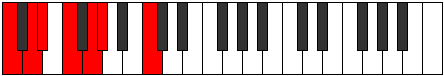

# Scale Dyrimic

## Links

- [Documentation](index.md)
- [Scales Index](Scales.md)
- [Modes Index](Modes.md)
- [Chords Index](Chords.md)

## Cardinality

6 Notes

## Perfection

- 4 Perfect Pitch
- 2 Imperfect Pitch
- [true true false false true true] Perfection Profile

## Modes

| Number | Mode | Notes | Illustration | Audio |
|--------|------|-------|--------------|-------|
| [429](https://ianring.com/musictheory/scales/429) | [Koptimic](ModeKoptimic.md) | C, **D**, **Eb**, F, G, Ab, C |  | [midi](ModeCNaturalKoptimic.mid) [ogg](ModeCNaturalKoptimic.ogg) | 
| [1131](https://ianring.com/musictheory/scales/1131) | [Thocrimic](ModeThocrimic.md) | **C**, **Db**, Eb, F, Gb, A#, **C** |  | [midi](ModeCNaturalThocrimic.mid) [ogg](ModeCNaturalThocrimic.ogg) | 
| [1443](https://ianring.com/musictheory/scales/1443) | [Ionarimic](ModeIonarimic.md) | C, Db, E#, **F##**, **G#**, A#, C |  | [midi](ModeCNaturalIonarimic.mid) [ogg](ModeCNaturalIonarimic.ogg) | 
| [1677](https://ianring.com/musictheory/scales/1677) | [Danimic](ModeDanimic.md) | C, D, Eb, F##, **G##**, **A#**, C |  | [midi](ModeCNaturalDanimic.mid) [ogg](ModeCNaturalDanimic.ogg) | 
| [2613](https://ianring.com/musictheory/scales/2613) | [Aeolanimic](ModeAeolanimic.md) | **C**, D, E, F, G##, **A##**, **C** |  | [midi](ModeCNaturalAeolanimic.mid) [ogg](ModeCNaturalAeolanimic.ogg) | 
| [2769](https://ianring.com/musictheory/scales/2769) | [Dyrimic](ModeDyrimic.md) | C, D##, **E##**, **F##**, G##, A##, C |  | [midi](ModeCNaturalDyrimic.mid) [ogg](ModeCNaturalDyrimic.ogg) | 
