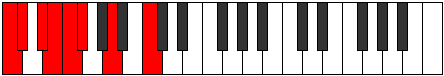

# Scale Epagian

## Links

- [Documentation](README.md)
- [Scales Index](Scales.md)
- [Modes Index](Modes.md)
- [Chords Index](Chords.md)

## Cardinality

7 Notes

## Perfection

- 3 Perfect Pitch
- 4 Imperfect Pitch
Perfection Profile - true, true, false, false, false, false, true

## Modes

| Number | Mode | Luminosity | Notes | Illustration | Audio |
|--------|------|------------|-------|--------------|-------|
| [635](https://ianring.com/musictheory/scales/635) | [Epolian](ModeEpolian.md) | 6 | **C**, **Db**, **Eb**, **Fb**, Gbb, Abbb, Bbb, **C** |  | [midi](https://github.com/edipermadi/music/blob/main/docs/ModeCNaturalEpolian.mid?raw=true) | 
| [985](https://ianring.com/musictheory/scales/985) | [Raptian](ModeRaptian.md) | -1 | C, **D#**, **E**, **F#**, **G**, Ab, Bbb, C |  | [midi](https://github.com/edipermadi/music/blob/main/docs/ModeCNaturalRaptian.mid?raw=true) | 
| [1615](https://ianring.com/musictheory/scales/1615) | [Sydian](ModeSydian.md) | -1 | **C**, **Db**, Ebb, Fbb, Gb, **A**, **Bb**, **C** |  | [midi](https://github.com/edipermadi/music/blob/main/docs/ModeCNaturalSydian.mid?raw=true) | 
| [2365](https://ianring.com/musictheory/scales/2365) | [Sythian](ModeSythian.md) | -1 | **C**, **D**, **Eb**, Fb, Gbb, Ab, **B**, **C** |  | [midi](https://github.com/edipermadi/music/blob/main/docs/ModeCNaturalSythian.mid?raw=true) | 
| [2855](https://ianring.com/musictheory/scales/2855) | [Epocrian](ModeEpocrian.md) | -1 | **C**, Db, Ebb, F, **G#**, **A**, **B**, **C** |  | [midi](https://github.com/edipermadi/music/blob/main/docs/ModeCNaturalEpocrian.mid?raw=true) | 
| [3475](https://ianring.com/musictheory/scales/3475) | [Kylian](ModeKylian.md) | 7 | C, Db, E, **F##**, **G#**, **A#**, **B**, C |  | [midi](https://github.com/edipermadi/music/blob/main/docs/ModeCNaturalKylian.mid?raw=true) | 
| [3785](https://ianring.com/musictheory/scales/3785) | [Epagian](ModeEpagian.md) | -1 | C, D#, **E##**, **F##**, **G##**, **A#**, B, C |  | [midi](https://github.com/edipermadi/music/blob/main/docs/ModeCNaturalEpagian.mid?raw=true) | 
