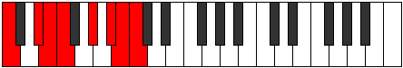

# Scale Epathian

## Links

- [Documentation](index.md)
- [Scales Index](Scales.md)
- [Modes Index](Modes.md)
- [Chords Index](Chords.md)

## Cardinality

7 Notes

## Perfection

- 5 Perfect Pitch
- 2 Imperfect Pitch
- [true true true false false true true] Perfection Profile

## Modes

| Number | Mode | Notes | Illustration | Audio |
|--------|------|-------|--------------|-------|
| [925](https://ianring.com/musictheory/scales/925) | [Mythian](ModeMythian.md) | C, D, **Eb**, **Fb**, G, Ab, Bbb, C |  | [midi](https://github.com/edipermadi/music/blob/main/docs/ModeCNaturalMythian.mid?raw=true) | 
| [935](https://ianring.com/musictheory/scales/935) | [Katarian](ModeKatarian.md) | C, Db, Ebb, F, G, **Ab**, **Bbb**, C |  | [midi](https://github.com/edipermadi/music/blob/main/docs/ModeCNaturalKatarian.mid?raw=true) | 
| [1255](https://ianring.com/musictheory/scales/1255) | [Sogian](ModeSogian.md) | C, **Db**, **Ebb**, F, Gb, Abb, Bb, C |  | [midi](https://github.com/edipermadi/music/blob/main/docs/ModeCNaturalSogian.mid?raw=true) | 
| [2515](https://ianring.com/musictheory/scales/2515) | [Stylian](ModeStylian.md) | C, Db, E, F#, **G**, **Ab**, B, C |  | [midi](https://github.com/edipermadi/music/blob/main/docs/ModeCNaturalStylian.mid?raw=true) | 
| [2675](https://ianring.com/musictheory/scales/2675) | [Gogian](ModeGogian.md) | **C**, **Db**, E, F, Gb, A, B, **C** |  | [midi](https://github.com/edipermadi/music/blob/main/docs/ModeCNaturalGogian.mid?raw=true) | 
| [3305](https://ianring.com/musictheory/scales/3305) | [Epathian](ModeEpathian.md) | C, D#, E#, **F#**, **G**, A#, B, C |  | [midi](https://github.com/edipermadi/music/blob/main/docs/ModeCNaturalEpathian.mid?raw=true) | 
| [3385](https://ianring.com/musictheory/scales/3385) | [Rothian](ModeRothian.md) | **C**, D#, E, F, G#, A#, **B**, **C** |  | [midi](https://github.com/edipermadi/music/blob/main/docs/ModeCNaturalRothian.mid?raw=true) | 
