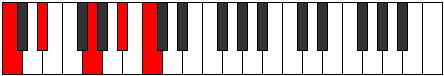

# Scale Epathic

## Links

- [Documentation](README.md)
- [Scales Index](Scales.md)
- [Modes Index](Modes.md)
- [Chords Index](Chords.md)

## Cardinality

4 Notes

## Perfection

- 2 Perfect Pitch
- 2 Imperfect Pitch
Perfection Profile - true, false, false, true

## Modes

| Number | Mode | Luminosity | Notes | Illustration | Audio |
|--------|------|------------|-------|--------------|-------|
| [297](https://ianring.com/musictheory/scales/297) | [Mynic](ModeMynic.md) | -1 | **C**, **D#**, F, G#, **C** |  | [midi](https://github.com/edipermadi/music/blob/main/docs/ModeCNaturalMynic.mid?raw=true) | 
| [549](https://ianring.com/musictheory/scales/549) | [Rothic](ModeRothic.md) | 3 | **C**, D, F, **A**, **C** |  | [midi](https://github.com/edipermadi/music/blob/main/docs/ModeCNaturalRothic.mid?raw=true) | 
| [657](https://ianring.com/musictheory/scales/657) | [Epathic](ModeEpathic.md) | 4 | C, **E**, **G**, A, C |  | [midi](https://github.com/edipermadi/music/blob/main/docs/ModeCNaturalEpathic.mid?raw=true) | 
| [1161](https://ianring.com/musictheory/scales/1161) | [Eporic](ModeEporic.md) | -1 | C, D#, **G**, **A#**, C |  | [midi](https://github.com/edipermadi/music/blob/main/docs/ModeCNaturalEporic.mid?raw=true) | 
