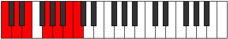

# Scale Epathimic

## Links

- [Documentation](README.md)
- [Scales Index](Scales.md)
- [Modes Index](Modes.md)
- [Chords Index](Chords.md)

## Cardinality

6 Notes

## Perfection

- 5 Perfect Pitch
- 1 Imperfect Pitch
Perfection Profile - true, true, true, false, true, true

## Modes

| Number | Mode | Luminosity | Notes | Illustration | Audio |
|--------|------|------------|-------|--------------|-------|
| [693](https://ianring.com/musictheory/scales/693) | [Mynimic](ModeMynimic.md) | 5 | C, D, **E**, F, G, A, C |  | [midi](https://github.com/edipermadi/music/blob/main/docs/ModeCNaturalMynimic.mid?raw=true) | 
| [1197](https://ianring.com/musictheory/scales/1197) | [Rocrimic](ModeRocrimic.md) | 3 | C, **D**, Eb, F, G, A#, C |  | [midi](https://github.com/edipermadi/music/blob/main/docs/ModeCNaturalRocrimic.mid?raw=true) | 
| [1323](https://ianring.com/musictheory/scales/1323) | [Eporimic](ModeEporimic.md) | 1 | **C**, Db, Eb, F, G#, A#, **C** |  | [midi](https://github.com/edipermadi/music/blob/main/docs/ModeCNaturalEporimic.mid?raw=true) | 
| [1449](https://ianring.com/musictheory/scales/1449) | [Epathimic](ModeEpathimic.md) | 2 | C, D#, E#, **F##**, G#, A#, C |  | [midi](https://github.com/edipermadi/music/blob/main/docs/ModeCNaturalEpathimic.mid?raw=true) | 
| [1701](https://ianring.com/musictheory/scales/1701) | [Lothimic](ModeLothimic.md) | 4 | C, D, E#, F##, **G##**, A#, C |  | [midi](https://github.com/edipermadi/music/blob/main/docs/ModeCNaturalLothimic.mid?raw=true) | 
| [2709](https://ianring.com/musictheory/scales/2709) | [Thaptimic](ModeThaptimic.md) | 6 | C, D, E, F##, G##, **A##**, C |  | [midi](https://github.com/edipermadi/music/blob/main/docs/ModeCNaturalThaptimic.mid?raw=true) | 
