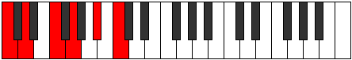

# Scale Epathitonic

## Links

- [Documentation](README.md)
- [Scales Index](Scales.md)
- [Modes Index](Modes.md)
- [Chords Index](Chords.md)

## Cardinality

5 Notes

## Perfection

- 4 Perfect Pitch
- 1 Imperfect Pitch
Perfection Profile - false, true, true, true, true

## Modes

| Number | Mode | Luminosity | Notes | Illustration | Audio |
|--------|------|------------|-------|--------------|-------|
| [661](https://ianring.com/musictheory/scales/661) | [Pentatonic](ModePentatonic.md) | 5 | C, D, **E**, G, A, C |  | [midi](https://github.com/edipermadi/music/blob/main/docs/ModeCNaturalPentatonic.mid?raw=true) | 
| [677](https://ianring.com/musictheory/scales/677) | [Mynitonic](ModeMynitonic.md) | 4 | C, D, F, G, **A**, C |  | [midi](https://github.com/edipermadi/music/blob/main/docs/ModeCNaturalMynitonic.mid?raw=true) | 
| [1189](https://ianring.com/musictheory/scales/1189) | [Thaptitonic](ModeThaptitonic.md) | 3 | C, **D**, F, G, A#, C |  | [midi](https://github.com/edipermadi/music/blob/main/docs/ModeCNaturalThaptitonic.mid?raw=true) | 
| [1193](https://ianring.com/musictheory/scales/1193) | [Rocritonic](ModeRocritonic.md) | 2 | C, D#, F, **G**, A#, C |  | [midi](https://github.com/edipermadi/music/blob/main/docs/ModeCNaturalRocritonic.mid?raw=true) | 
| [1321](https://ianring.com/musictheory/scales/1321) | [Epathitonic](ModeEpathitonic.md) | 1 | **C**, D#, F, G#, A#, **C** |  | [midi](https://github.com/edipermadi/music/blob/main/docs/ModeCNaturalEpathitonic.mid?raw=true) | 
