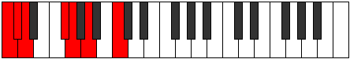

# Scale Epygimic

## Links

- [Documentation](README.md)
- [Scales Index](Scales.md)
- [Modes Index](Modes.md)
- [Chords Index](Chords.md)

## Cardinality

6 Notes

## Perfection

- 4 Perfect Pitch
- 2 Imperfect Pitch
Perfection Profile - true, true, true, false, true, false

## Modes

| Number | Mode | Luminosity | Notes | Illustration | Audio |
|--------|------|------------|-------|--------------|-------|
| [459](https://ianring.com/musictheory/scales/459) | [Zaptimic](ModeZaptimic.md) | 6 | C, Db, **Eb**, F#, **G**, Ab, C |  | [midi](https://github.com/edipermadi/music/blob/main/docs/ModeCNaturalZaptimic.mid?raw=true) | 
| [711](https://ianring.com/musictheory/scales/711) | [Epyrimic](ModeEpyrimic.md) | 6 | C, **Db**, Ebb, F#, G, **A**, C |  | [midi](https://github.com/edipermadi/music/blob/main/docs/ModeCNaturalEpyrimic.mid?raw=true) | 
| [1593](https://ianring.com/musictheory/scales/1593) | [Zogimic](ModeZogimic.md) | 3 | **C**, D#, **E**, F, G##, A#, **C** |  | [midi](https://github.com/edipermadi/music/blob/main/docs/ModeCNaturalZogimic.mid?raw=true) | 
| [2277](https://ianring.com/musictheory/scales/2277) | [Kagimic](ModeKagimic.md) | -1 | C, **D**, E#, **F#**, G, A##, C |  | [midi](https://github.com/edipermadi/music/blob/main/docs/ModeCNaturalKagimic.mid?raw=true) | 
| [2403](https://ianring.com/musictheory/scales/2403) | [Lycrimic](ModeLycrimic.md) | -1 | **C**, Db, E#, F#, **G#**, A##, **C** |  | [midi](https://github.com/edipermadi/music/blob/main/docs/ModeCNaturalLycrimic.mid?raw=true) | 
| [3249](https://ianring.com/musictheory/scales/3249) | [Epygimic](ModeEpygimic.md) | -1 | C, D##, E#, **F##**, G###, **A##**, C |  | [midi](https://github.com/edipermadi/music/blob/main/docs/ModeCNaturalEpygimic.mid?raw=true) | 
