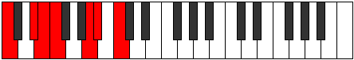

# Scale Epygimic

## Links

- [Documentation](index.md)
- [Scales Index](Scales.md)
- [Modes Index](Modes.md)
- [Chords Index](Chords.md)

## Cardinality

6 Notes

## Perfection

- 4 Perfect Pitch
- 2 Imperfect Pitch
- [true true true false true false] Perfection Profile

## Modes

| Number | Mode | Notes | Illustration | Audio |
|--------|------|-------|--------------|-------|
| [459](https://ianring.com/musictheory/scales/459) | [Zaptimic](ModeZaptimic.md) | C, Db, **Eb**, F#, **G**, Ab, C |  | [midi](ModeCNaturalZaptimic.mid) [ogg](ModeCNaturalZaptimic.ogg) | 
| [711](https://ianring.com/musictheory/scales/711) | [Epyrimic](ModeEpyrimic.md) | C, **Db**, Ebb, F#, G, **A**, C |  | [midi](ModeCNaturalEpyrimic.mid) [ogg](ModeCNaturalEpyrimic.ogg) | 
| [1593](https://ianring.com/musictheory/scales/1593) | [Zogimic](ModeZogimic.md) | **C**, D#, **E**, F, G##, A#, **C** |  | [midi](ModeCNaturalZogimic.mid) [ogg](ModeCNaturalZogimic.ogg) | 
| [2277](https://ianring.com/musictheory/scales/2277) | [Kagimic](ModeKagimic.md) | C, **D**, E#, **F#**, G, A##, C |  | [midi](ModeCNaturalKagimic.mid) [ogg](ModeCNaturalKagimic.ogg) | 
| [2403](https://ianring.com/musictheory/scales/2403) | [Lycrimic](ModeLycrimic.md) | **C**, Db, E#, F#, **G#**, A##, **C** |  | [midi](ModeCNaturalLycrimic.mid) [ogg](ModeCNaturalLycrimic.ogg) | 
| [3249](https://ianring.com/musictheory/scales/3249) | [Epygimic](ModeEpygimic.md) | C, D##, E#, **F##**, G###, **A##**, C |  | [midi](ModeCNaturalEpygimic.mid) [ogg](ModeCNaturalEpygimic.ogg) | 
