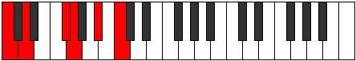

# Scale Epygitonic

## Links

- [Documentation](index.md)
- [Scales Index](Scales.md)
- [Modes Index](Modes.md)
- [Chords Index](Chords.md)

## Cardinality

5 Notes

## Perfection

- 2 Perfect Pitch
- 3 Imperfect Pitch
- [false false true false true] Perfection Profile

## Modes

| Number | Mode | Notes | Illustration | Audio |
|--------|------|-------|--------------|-------|
| [339](https://ianring.com/musictheory/scales/339) | [Zaptitonic](ModeZaptitonic.md) | **C**, C#, **E**, F#, **G#**, **C** |  | [midi](https://github.com/edipermadi/music/blob/main/docs/ModeCNaturalZaptitonic.mid?raw=true) | 
| [789](https://ianring.com/musictheory/scales/789) | [Zogitonic](ModeZogitonic.md) | **C**, D, **E**, **G#**, A, **C** |  | [midi](https://github.com/edipermadi/music/blob/main/docs/ModeCNaturalZogitonic.mid?raw=true) | 
| [1221](https://ianring.com/musictheory/scales/1221) | [Epyritonic](ModeEpyritonic.md) | C, **D**, **F#**, G, **A#**, C |  | [midi](https://github.com/edipermadi/music/blob/main/docs/ModeCNaturalEpyritonic.mid?raw=true) | 
| [1329](https://ianring.com/musictheory/scales/1329) | [Epygitonic](ModeEpygitonic.md) | **C**, **E**, F, **G#**, A#, **C** |  | [midi](https://github.com/edipermadi/music/blob/main/docs/ModeCNaturalEpygitonic.mid?raw=true) | 
| [2217](https://ianring.com/musictheory/scales/2217) | [Kagitonic](ModeKagitonic.md) | C, **D#**, F, **G**, **B**, C |  | [midi](https://github.com/edipermadi/music/blob/main/docs/ModeCNaturalKagitonic.mid?raw=true) | 
