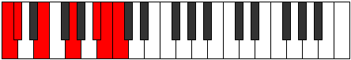

# Scale Epynimic

## Links

- [Documentation](index.md)
- [Scales Index](Scales.md)
- [Modes Index](Modes.md)
- [Chords Index](Chords.md)

## Cardinality

6 Notes

## Perfection

- 2 Perfect Pitch
- 4 Imperfect Pitch
- [false true false false false true] Perfection Profile

## Modes

| Number | Mode | Notes | Illustration | Audio |
|--------|------|-------|--------------|-------|
| [591](https://ianring.com/musictheory/scales/591) | [Gaptimic](ModeGaptimic.md) | **C**, **Db**, Ebb, **Fbb**, Gb, **A**, **C** |  | [midi](ModeCNaturalGaptimic.mid) [ogg](ModeCNaturalGaptimic.ogg) | 
| [633](https://ianring.com/musictheory/scales/633) | [Kydimic](ModeKydimic.md) | **C**, **D#**, **E**, F, **Gb**, A, **C** |  | [midi](ModeCNaturalKydimic.mid) [ogg](ModeCNaturalKydimic.ogg) | 
| [969](https://ianring.com/musictheory/scales/969) | [Ionogimic](ModeIonogimic.md) | C, **D#**, **E##**, **F##**, G#, **A**, C |  | [midi](ModeCNaturalIonogimic.mid) [ogg](ModeCNaturalIonogimic.ogg) | 
| [2343](https://ianring.com/musictheory/scales/2343) | [Tharimic](ModeTharimic.md) | **C**, Db, **Ebb**, F, **G#**, **A##**, **C** |  | [midi](ModeCNaturalTharimic.mid) [ogg](ModeCNaturalTharimic.ogg) | 
| [3219](https://ianring.com/musictheory/scales/3219) | [Ionaphimic](ModeIonaphimic.md) | C, **Db**, E, **F##**, **G###**, **A##**, C |  | [midi](ModeCNaturalIonaphimic.mid) [ogg](ModeCNaturalIonaphimic.ogg) | 
| [3657](https://ianring.com/musictheory/scales/3657) | [Epynimic](ModeEpynimic.md) | **C**, D#, **E##**, **Cbbb**, **Cbb**, Dbbb, **C** |  | [midi](ModeCNaturalEpynimic.mid) [ogg](ModeCNaturalEpynimic.ogg) | 
