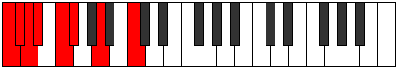

# Scale Gacrian

## Links

- [Documentation](index.md)
- [Scales Index](Scales.md)
- [Modes Index](Modes.md)
- [Chords Index](Chords.md)

## Cardinality

7 Notes

## Perfection

- 3 Perfect Pitch
- 4 Imperfect Pitch
- [true false false false true false true] Perfection Profile

## Modes

| Number | Mode | Notes | Illustration | Audio |
|--------|------|-------|--------------|-------|
| [623](https://ianring.com/musictheory/scales/623) | [Sycrian](ModeSycrian.md) | **C**, **Db**, Ebb, **Fbb**, Gbb, Abbb, **Bbb**, **C** |  | [midi](ModeCNaturalSycrian.mid) [ogg](ModeCNaturalSycrian.ogg) | 
| [889](https://ianring.com/musictheory/scales/889) | [Borian](ModeBorian.md) | **C**, **D#**, **E**, F, **Gb**, Ab, Bbb, **C** |  | [midi](ModeCNaturalBorian.mid) [ogg](ModeCNaturalBorian.ogg) | 
| [1939](https://ianring.com/musictheory/scales/1939) | [Dathian](ModeDathian.md) | C, Db, **E**, **F##**, **G#**, A, **Bb**, C |  | [midi](ModeCNaturalDathian.mid) [ogg](ModeCNaturalDathian.ogg) | 
| [2359](https://ianring.com/musictheory/scales/2359) | [Gadian](ModeGadian.md) | **C**, Db, **Ebb**, Fb, Gbb, **Ab**, **B**, **C** |  | [midi](ModeCNaturalGadian.mid) [ogg](ModeCNaturalGadian.ogg) | 
| [3017](https://ianring.com/musictheory/scales/3017) | [Gacrian](ModeGacrian.md) | C, **D#**, **E##**, **F##**, G#, **A**, B, C |  | [midi](ModeCNaturalGacrian.mid) [ogg](ModeCNaturalGacrian.ogg) | 
| [3227](https://ianring.com/musictheory/scales/3227) | [Aeolocrian](ModeAeolocrian.md) | C, **Db**, Eb, Fb, **G**, **A#**, **B**, C |  | [midi](ModeCNaturalAeolocrian.mid) [ogg](ModeCNaturalAeolocrian.ogg) | 
| [3661](https://ianring.com/musictheory/scales/3661) | [Mixodorian](ModeMixodorian.md) | **C**, D, Eb, **F#**, **G##**, **A#**, B, **C** |  | [midi](ModeCNaturalMixodorian.mid) [ogg](ModeCNaturalMixodorian.ogg) | 
