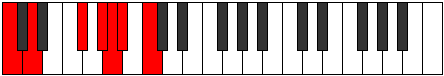

# Scale Gacrimic

## Links

- [Documentation](index.md)
- [Scales Index](Scales.md)
- [Modes Index](Modes.md)
- [Chords Index](Chords.md)

## Cardinality

6 Notes

## Perfection

- 1 Perfect Pitch
- 5 Imperfect Pitch
- [true false false false false false] Perfection Profile

## Modes

| Number | Mode | Notes | Illustration | Audio |
|--------|------|-------|--------------|-------|
| [349](https://ianring.com/musictheory/scales/349) | [Borimic](ModeBorimic.md) | **C**, **D**, **Eb**, **Fb**, **Gb**, Ab, **C** |  | [midi](https://github.com/edipermadi/music/blob/main/docs/ModeCNaturalBorimic.mid?raw=true) | 
| [1111](https://ianring.com/musictheory/scales/1111) | [Sycrimic](ModeSycrimic.md) | **C**, **Db**, **Ebb**, **Fb**, Gb, **A#**, **C** |  | [midi](https://github.com/edipermadi/music/blob/main/docs/ModeCNaturalSycrimic.mid?raw=true) | 
| [1489](https://ianring.com/musictheory/scales/1489) | [Gacrimic](ModeGacrimic.md) | C, **D##**, **E##**, **F##**, **G#**, **A#**, C |  | [midi](https://github.com/edipermadi/music/blob/main/docs/ModeCNaturalGacrimic.mid?raw=true) | 
| [1861](https://ianring.com/musictheory/scales/1861) | [Phrygimic](ModePhrygimic.md) | **C**, D, **E##**, **F###**, **G##**, **A#**, **C** |  | [midi](https://github.com/edipermadi/music/blob/main/docs/ModeCNaturalPhrygimic.mid?raw=true) | 
| [2603](https://ianring.com/musictheory/scales/2603) | [Gadimic](ModeGadimic.md) | **C**, **Db**, **Eb**, F, **G##**, **A##**, **C** |  | [midi](https://github.com/edipermadi/music/blob/main/docs/ModeCNaturalGadimic.mid?raw=true) | 
| [3349](https://ianring.com/musictheory/scales/3349) | [Aeolocrimic](ModeAeolocrimic.md) | **C**, **D**, E, **F###**, **G###**, **A##**, **C** |  | [midi](https://github.com/edipermadi/music/blob/main/docs/ModeCNaturalAeolocrimic.mid?raw=true) | 
