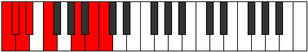
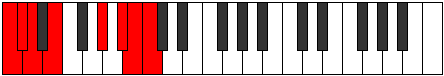
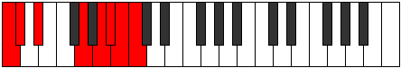

# Scale Gydian

## Links

- [Documentation](README.md)
- [Scales Index](Scales.md)
- [Modes Index](Modes.md)
- [Chords Index](Chords.md)

## Cardinality

7 Notes

## Perfection

- 2 Perfect Pitch
- 5 Imperfect Pitch
Perfection Profile - true, false, false, false, false, true, false

## Modes

| Number | Mode | Luminosity | Notes | Illustration | Audio |
|--------|------|------------|-------|--------------|-------|
| [381](https://ianring.com/musictheory/scales/381) | [Kogian](ModeKogian.md) | -1 | **C**, **D**, **Eb**, **Fb**, Gbb, **Abbb**, Bbbb, **C** |  | [midi](https://github.com/edipermadi/music/blob/main/docs/ModeCNaturalKogian.mid?raw=true) | 
| [1119](https://ianring.com/musictheory/scales/1119) | [Rarian](ModeRarian.md) | -1 | **C**, **Db**, **Ebb**, Fbb, **Gbbb**, Abbb, **Bb**, **C** |  | [midi](https://github.com/edipermadi/music/blob/main/docs/ModeCNaturalRarian.mid?raw=true) | 
| [2001](https://ianring.com/musictheory/scales/2001) | [Gydian](ModeGydian.md) | 7 | C, **D##**, **E##**, **F##**, **G#**, A, **Bb**, C |  | [midi](https://github.com/edipermadi/music/blob/main/docs/ModeCNaturalGydian.mid?raw=true) | 
| [2607](https://ianring.com/musictheory/scales/2607) | [Aerolian](ModeAerolian.md) | -1 | **C**, **Db**, Ebb, **Fbb**, Gbb, **A**, **B**, **C** |  | [midi](https://github.com/edipermadi/music/blob/main/docs/ModeCNaturalAerolian.mid?raw=true) | 
| [3351](https://ianring.com/musictheory/scales/3351) | [Karian](ModeKarian.md) | -1 | **C**, Db, **Ebb**, Fb, **G#**, **A#**, **B**, **C** |  | [midi](https://github.com/edipermadi/music/blob/main/docs/ModeCNaturalKarian.mid?raw=true) | 
| [3723](https://ianring.com/musictheory/scales/3723) | [Myptian](ModeMyptian.md) | 7 | C, **Db**, Eb, **F##**, **G##**, **A#**, **B**, C |  | [midi](https://github.com/edipermadi/music/blob/main/docs/ModeCNaturalMyptian.mid?raw=true) | 
| [3909](https://ianring.com/musictheory/scales/3909) | [Rydian](ModeRydian.md) | -1 | **C**, D, **E##**, **F###**, **G##**, **A#**, B, **C** |  | [midi](https://github.com/edipermadi/music/blob/main/docs/ModeCNaturalRydian.mid?raw=true) | 
