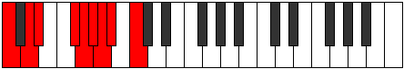
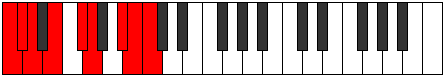

# Scale Gythyllic

## Links

- [Documentation](index.md)
- [Scales Index](Scales.md)
- [Modes Index](Modes.md)
- [Chords Index](Chords.md)

## Cardinality

8 Notes

## Perfection

- 5 Perfect Pitch
- 3 Imperfect Pitch
- [true false true true false false true true] Perfection Profile

## Modes

| Number | Mode | Notes | Illustration | Audio |
|--------|------|-------|--------------|-------|
| [863](https://ianring.com/musictheory/scales/863) | [Pyryllic](ModePyryllic.md) | **C**, C#, D, **D#**, **E**, F#, G#, A, **C** |  | [midi](https://github.com/edipermadi/music/blob/main/docs/ModeCNaturalPyryllic.mid?raw=true) | 
| [1523](https://ianring.com/musictheory/scales/1523) | [Zothyllic](ModeZothyllic.md) | C, C#, **E**, F, F#, **G**, **G#**, A#, C |  | [midi](https://github.com/edipermadi/music/blob/main/docs/ModeCNaturalZothyllic.mid?raw=true) | 
| [1997](https://ianring.com/musictheory/scales/1997) | [Staryllic](ModeStaryllic.md) | C, D, D#, **F#**, G, G#, **A**, **A#**, C |  | [midi](https://github.com/edipermadi/music/blob/main/docs/ModeCNaturalStaryllic.mid?raw=true) | 
| [2479](https://ianring.com/musictheory/scales/2479) | [Rycryllic](ModeRycryllic.md) | C, C#, **D**, **D#**, F, G, G#, **B**, C |  | [midi](https://github.com/edipermadi/music/blob/main/docs/ModeCNaturalRycryllic.mid?raw=true) | 
| [2809](https://ianring.com/musictheory/scales/2809) | [Gythyllic](ModeGythyllic.md) | C, **D#**, E, F, **F#**, **G**, A, B, C |  | [midi](https://github.com/edipermadi/music/blob/main/docs/ModeCNaturalGythyllic.mid?raw=true) | 
| [3287](https://ianring.com/musictheory/scales/3287) | [Phrathyllic](ModePhrathyllic.md) | C, **C#**, **D**, E, F#, G, **A#**, B, C |  | [midi](https://github.com/edipermadi/music/blob/main/docs/ModeCNaturalPhrathyllic.mid?raw=true) | 
| [3691](https://ianring.com/musictheory/scales/3691) | [Badyllic](ModeBadyllic.md) | **C**, **C#**, D#, F, F#, **A**, A#, B, **C** |  | [midi](https://github.com/edipermadi/music/blob/main/docs/ModeCNaturalBadyllic.mid?raw=true) | 
| [3893](https://ianring.com/musictheory/scales/3893) | [Phrocryllic](ModePhrocryllic.md) | **C**, D, E, F, **G#**, A, A#, **B**, **C** |  | [midi](https://github.com/edipermadi/music/blob/main/docs/ModeCNaturalPhrocryllic.mid?raw=true) | 
