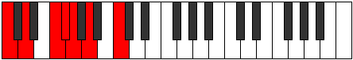
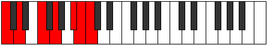

# Scale Ionacrimic

## Links

- [Documentation](README.md)
- [Scales Index](Scales.md)
- [Modes Index](Modes.md)
- [Chords Index](Chords.md)

## Cardinality

6 Notes

## Perfection

- 4 Perfect Pitch
- 2 Imperfect Pitch
- [false true true true false true] Perfection Profile

## Modes

| Number | Mode | Notes | Illustration | Audio |
|--------|------|-------|--------------|-------|
| [663](https://ianring.com/musictheory/scales/663) | [Phrynimic](ModePhrynimic.md) | C, **Db**, Ebb, **Fb**, G, A, C |  | [midi](https://github.com/edipermadi/music/blob/main/docs/ModeCNaturalPhrynimic.mid?raw=true) | 
| [741](https://ianring.com/musictheory/scales/741) | [Gathimic](ModeGathimic.md) | C, D, E#, **F#**, G, **A**, C |  | [midi](https://github.com/edipermadi/music/blob/main/docs/ModeCNaturalGathimic.mid?raw=true) | 
| [1209](https://ianring.com/musictheory/scales/1209) | [Ionynimic](ModeIonynimic.md) | C, D#, **E**, F, **G**, A#, C |  | [midi](https://github.com/edipermadi/music/blob/main/docs/ModeCNaturalIonynimic.mid?raw=true) | 
| [1833](https://ianring.com/musictheory/scales/1833) | [Ionacrimic](ModeIonacrimic.md) | **C**, D#, E#, F###, **G##**, A#, **C** |  | [midi](https://github.com/edipermadi/music/blob/main/docs/ModeCNaturalIonacrimic.mid?raw=true) | 
| [2379](https://ianring.com/musictheory/scales/2379) | [Stathimic](ModeStathimic.md) | **C**, Db, **Eb**, F#, G#, A##, **C** |  | [midi](https://github.com/edipermadi/music/blob/main/docs/ModeCNaturalStathimic.mid?raw=true) | 
| [3237](https://ianring.com/musictheory/scales/3237) | [Thatimic](ModeThatimic.md) | C, **D**, E#, F##, G###, **A##**, C |  | [midi](https://github.com/edipermadi/music/blob/main/docs/ModeCNaturalThatimic.mid?raw=true) | 
