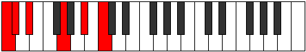

# Scale Ionaditonic

## Links

- [Documentation](index.md)
- [Scales Index](Scales.md)
- [Modes Index](Modes.md)
- [Chords Index](Chords.md)

## Cardinality

5 Notes

## Perfection

- 2 Perfect Pitch
- 3 Imperfect Pitch
- [true false false true false] Perfection Profile

## Modes

| Number | Mode | Notes | Illustration | Audio |
|--------|------|-------|--------------|-------|
| [361](https://ianring.com/musictheory/scales/361) | [Bocritonic](ModeBocritonic.md) | **C**, **D#**, F, **F#**, G#, **C** |  | [midi](https://github.com/edipermadi/music/blob/main/docs/ModeCNaturalBocritonic.mid?raw=true) | 
| [557](https://ianring.com/musictheory/scales/557) | [Gythitonic](ModeGythitonic.md) | **C**, D, **D#**, F, **A**, **C** |  | [midi](https://github.com/edipermadi/music/blob/main/docs/ModeCNaturalGythitonic.mid?raw=true) | 
| [1163](https://ianring.com/musictheory/scales/1163) | [Pagitonic](ModePagitonic.md) | C, **C#**, D#, **G**, **A#**, C |  | [midi](https://github.com/edipermadi/music/blob/main/docs/ModeCNaturalPagitonic.mid?raw=true) | 
| [1681](https://ianring.com/musictheory/scales/1681) | [Ionaditonic](ModeIonaditonic.md) | C, **E**, **G**, A, **A#**, C |  | [midi](https://github.com/edipermadi/music/blob/main/docs/ModeCNaturalIonaditonic.mid?raw=true) | 
| [2629](https://ianring.com/musictheory/scales/2629) | [Aeolythitonic](ModeAeolythitonic.md) | **C**, D, **F#**, **A**, B, **C** |  | [midi](https://github.com/edipermadi/music/blob/main/docs/ModeCNaturalAeolythitonic.mid?raw=true) | 
