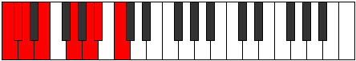

# Scale Ionopian

## Links

- [Documentation](index.md)
- [Scales Index](Scales.md)
- [Modes Index](Modes.md)
- [Chords Index](Chords.md)

## Cardinality

7 Notes

## Perfection

- 4 Perfect Pitch
- 3 Imperfect Pitch
- [false true true false true false true] Perfection Profile

## Modes

| Number | Mode | Notes | Illustration | Audio |
|--------|------|-------|--------------|-------|
| [749](https://ianring.com/musictheory/scales/749) | [Aeologian](ModeAeologian.md) | C, D, **Eb**, F, **Gb**, Abb, **Bbb**, C |  | [midi](ModeCNaturalAeologian.mid) [ogg](ModeCNaturalAeologian.ogg) | 
| [1211](https://ianring.com/musictheory/scales/1211) | [Zadian](ModeZadian.md) | C, **Db**, Eb, **Fb**, Gbb, **Abb**, Bb, C |  | [midi](ModeCNaturalZadian.mid) [ogg](ModeCNaturalZadian.ogg) | 
| [1687](https://ianring.com/musictheory/scales/1687) | [Phralian](ModePhralian.md) | C, **Db**, Ebb, **Fb**, G, A, **Bb**, C |  | [midi](ModeCNaturalPhralian.mid) [ogg](ModeCNaturalPhralian.ogg) | 
| [1897](https://ianring.com/musictheory/scales/1897) | [Ionopian](ModeIonopian.md) | **C**, D#, E#, **F#**, G#, **A**, Bb, **C** |  | [midi](ModeCNaturalIonopian.mid) [ogg](ModeCNaturalIonopian.ogg) | 
| [2653](https://ianring.com/musictheory/scales/2653) | [Sygian](ModeSygian.md) | **C**, D, **Eb**, Fb, **Gb**, A, B, **C** |  | [midi](ModeCNaturalSygian.mid) [ogg](ModeCNaturalSygian.ogg) | 
| [2891](https://ianring.com/musictheory/scales/2891) | [Phrogian](ModePhrogian.md) | **C**, Db, **Eb**, F#, G#, **A**, B, **C** |  | [midi](ModeCNaturalPhrogian.mid) [ogg](ModeCNaturalPhrogian.ogg) | 
| [3493](https://ianring.com/musictheory/scales/3493) | [Rathian](ModeRathian.md) | C, **D**, E#, F##, **G#**, A#, **B**, C |  | [midi](ModeCNaturalRathian.mid) [ogg](ModeCNaturalRathian.ogg) | 
