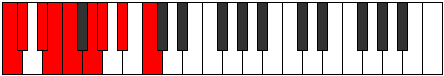

# Scale Ionoptyllic

## Links

- [Documentation](README.md)
- [Scales Index](Scales.md)
- [Modes Index](Modes.md)
- [Chords Index](Chords.md)

## Cardinality

8 Notes

## Perfection

- 6 Perfect Pitch
- 2 Imperfect Pitch
Perfection Profile - true, true, true, true, true, false, true, false

## Modes

| Number | Mode | Luminosity | Notes | Illustration | Audio |
|--------|------|------------|-------|--------------|-------|
| [1467](https://ianring.com/musictheory/scales/1467) | [Thydyllic](ModeThydyllic.md) | 3 | C, C#, D#, **E**, F, **G**, G#, A#, C |  | [midi](https://github.com/edipermadi/music/blob/main/docs/ModeCNaturalThydyllic.mid?raw=true) | 
| [1719](https://ianring.com/musictheory/scales/1719) | [Lyryllic](ModeLyryllic.md) | 6 | C, **C#**, D, **E**, F, G, A, A#, C |  | [midi](https://github.com/edipermadi/music/blob/main/docs/ModeCNaturalLyryllic.mid?raw=true) | 
| [1773](https://ianring.com/musictheory/scales/1773) | [Aeoloryllic](ModeAeoloryllic.md) | 5 | C, D, D#, F, **F#**, G, **A**, A#, C |  | [midi](https://github.com/edipermadi/music/blob/main/docs/ModeCNaturalAeoloryllic.mid?raw=true) | 
| [1899](https://ianring.com/musictheory/scales/1899) | [Moptyllic](ModeMoptyllic.md) | 2 | **C**, C#, D#, F, F#, G#, **A**, A#, **C** |  | [midi](https://github.com/edipermadi/music/blob/main/docs/ModeCNaturalMoptyllic.mid?raw=true) | 
| [2781](https://ianring.com/musictheory/scales/2781) | [Gycryllic](ModeGycryllic.md) | 8 | C, D, **D#**, E, **F#**, G, A, B, C |  | [midi](https://github.com/edipermadi/music/blob/main/docs/ModeCNaturalGycryllic.mid?raw=true) | 
| [2907](https://ianring.com/musictheory/scales/2907) | [Mogyllic](ModeMogyllic.md) | -1 | **C**, C#, **D#**, E, F#, G#, A, B, **C** |  | [midi](https://github.com/edipermadi/music/blob/main/docs/ModeCNaturalMogyllic.mid?raw=true) | 
| [2997](https://ianring.com/musictheory/scales/2997) | [Ionoptyllic](ModeIonoptyllic.md) | 7 | C, D, E, F, G, **G#**, A, **B**, C |  | [midi](https://github.com/edipermadi/music/blob/main/docs/ModeCNaturalIonoptyllic.mid?raw=true) | 
| [3501](https://ianring.com/musictheory/scales/3501) | [Katodyllic](ModeKatodyllic.md) | 4 | C, **D**, D#, F, G, G#, A#, **B**, C |  | [midi](https://github.com/edipermadi/music/blob/main/docs/ModeCNaturalKatodyllic.mid?raw=true) | 
