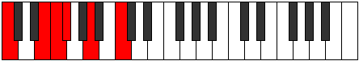

# Scale Ionyptitonic

## Links

- [Documentation](README.md)
- [Scales Index](Scales.md)
- [Modes Index](Modes.md)
- [Chords Index](Chords.md)

## Cardinality

5 Notes

## Perfection

- 2 Perfect Pitch
- 3 Imperfect Pitch
Perfection Profile - false, false, true, false, true

## Modes

| Number | Mode | Luminosity | Notes | Illustration | Audio |
|--------|------|------------|-------|--------------|-------|
| [295](https://ianring.com/musictheory/scales/295) | [Gyritonic](ModeGyritonic.md) | 4 | **C**, C#, **D**, F, **G#**, **C** |  | [midi](https://github.com/edipermadi/music/blob/main/docs/ModeCNaturalGyritonic.mid?raw=true) | 
| [625](https://ianring.com/musictheory/scales/625) | [Ionyptitonic](ModeIonyptitonic.md) | 4 | **C**, **E**, F, **F#**, A, **C** |  | [midi](https://github.com/edipermadi/music/blob/main/docs/ModeCNaturalIonyptitonic.mid?raw=true) | 
| [905](https://ianring.com/musictheory/scales/905) | [Bylitonic](ModeBylitonic.md) | -1 | C, **D#**, **G**, G#, **A**, C |  | [midi](https://github.com/edipermadi/music/blob/main/docs/ModeCNaturalBylitonic.mid?raw=true) | 
| [2195](https://ianring.com/musictheory/scales/2195) | [Zalitonic](ModeZalitonic.md) | -1 | C, **C#**, E, **G**, **B**, C |  | [midi](https://github.com/edipermadi/music/blob/main/docs/ModeCNaturalZalitonic.mid?raw=true) | 
| [3145](https://ianring.com/musictheory/scales/3145) | [Stolitonic](ModeStolitonic.md) | -1 | **C**, D#, **F#**, **A#**, B, **C** |  | [midi](https://github.com/edipermadi/music/blob/main/docs/ModeCNaturalStolitonic.mid?raw=true) | 
