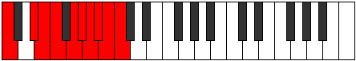

# Scale Kalygic

## Links

- [Documentation](README.md)
- [Scales Index](Scales.md)
- [Modes Index](Modes.md)
- [Chords Index](Chords.md)

## Cardinality

9 Notes

## Perfection

- 7 Perfect Pitch
- 2 Imperfect Pitch
- [true true true true false true true true false] Perfection Profile

## Modes

| Number | Mode | Notes | Illustration | Audio |
|--------|------|-------|--------------|-------|
| [1015](https://ianring.com/musictheory/scales/1015) | [Ionodygic](ModeIonodygic.md) | C, C#, D, **E**, F, F#, G, **G#**, A, C |  | [midi](https://github.com/edipermadi/music/blob/main/docs/ModeCNaturalIonodygic.mid?raw=true) | 
| [1855](https://ianring.com/musictheory/scales/1855) | [Marygic](ModeMarygic.md) | **C**, C#, D, D#, **E**, F, G#, A, A#, **C** |  | [midi](https://github.com/edipermadi/music/blob/main/docs/ModeCNaturalMarygic.mid?raw=true) | 
| [2555](https://ianring.com/musictheory/scales/2555) | [Bythygic](ModeBythygic.md) | C, C#, **D#**, E, F, F#, **G**, G#, B, C |  | [midi](https://github.com/edipermadi/music/blob/main/docs/ModeCNaturalBythygic.mid?raw=true) | 
| [2975](https://ianring.com/musictheory/scales/2975) | [Gaptygic](ModeGaptygic.md) | C, C#, D, **D#**, E, G, G#, A, **B**, C |  | [midi](https://github.com/edipermadi/music/blob/main/docs/ModeCNaturalGaptygic.mid?raw=true) | 
| [3325](https://ianring.com/musictheory/scales/3325) | [Epygic](ModeEpygic.md) | C, **D**, D#, E, F, **F#**, G, A#, B, C |  | [midi](https://github.com/edipermadi/music/blob/main/docs/ModeCNaturalEpygic.mid?raw=true) | 
| [3535](https://ianring.com/musictheory/scales/3535) | [Aeroptygic](ModeAeroptygic.md) | C, C#, **D**, D#, F#, G, G#, **A#**, B, C |  | [midi](https://github.com/edipermadi/music/blob/main/docs/ModeCNaturalAeroptygic.mid?raw=true) | 
| [3815](https://ianring.com/musictheory/scales/3815) | [Mylygic](ModeMylygic.md) | C, **C#**, D, F, F#, G, **A**, A#, B, C |  | [midi](https://github.com/edipermadi/music/blob/main/docs/ModeCNaturalMylygic.mid?raw=true) | 
| [3955](https://ianring.com/musictheory/scales/3955) | [Galygic](ModeGalygic.md) | **C**, C#, E, F, F#, **G#**, A, A#, B, **C** |  | [midi](https://github.com/edipermadi/music/blob/main/docs/ModeCNaturalGalygic.mid?raw=true) | 
| [4025](https://ianring.com/musictheory/scales/4025) | [Kalygic](ModeKalygic.md) | C, D#, E, F, **G**, G#, A, A#, **B**, C |  | [midi](https://github.com/edipermadi/music/blob/main/docs/ModeCNaturalKalygic.mid?raw=true) | 
