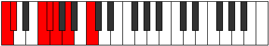

# Scale Kanimic

## Links

- [Documentation](README.md)
- [Scales Index](Scales.md)
- [Modes Index](Modes.md)
- [Chords Index](Chords.md)

## Cardinality

6 Notes

## Perfection

- 3 Perfect Pitch
- 3 Imperfect Pitch
Perfection Profile - false, true, true, false, false, true

## Modes

| Number | Mode | Luminosity | Notes | Illustration | Audio |
|--------|------|------------|-------|--------------|-------|
| [407](https://ianring.com/musictheory/scales/407) | [Zylimic](ModeZylimic.md) | 6 | C, Db, **Ebb**, **Fb**, G, **Ab**, C |  | [midi](https://github.com/edipermadi/music/blob/main/docs/ModeCNaturalZylimic.mid?raw=true) | 
| [739](https://ianring.com/musictheory/scales/739) | [Rorimic](ModeRorimic.md) | 5 | C, **Db**, E#, F#, **G**, **A**, C |  | [midi](https://github.com/edipermadi/music/blob/main/docs/ModeCNaturalRorimic.mid?raw=true) | 
| [1817](https://ianring.com/musictheory/scales/1817) | [Phrythimic](ModePhrythimic.md) | -1 | **C**, D#, **E**, F###, G##, **A#**, **C** |  | [midi](https://github.com/edipermadi/music/blob/main/docs/ModeCNaturalPhrythimic.mid?raw=true) | 
| [2251](https://ianring.com/musictheory/scales/2251) | [Zodimic](ModeZodimic.md) | -1 | C, **Db**, **Eb**, F#, **G**, A##, C |  | [midi](https://github.com/edipermadi/music/blob/main/docs/ModeCNaturalZodimic.mid?raw=true) | 
| [2417](https://ianring.com/musictheory/scales/2417) | [Kanimic](ModeKanimic.md) | 5 | **C**, D##, E#, **F#**, **G#**, A##, **C** |  | [midi](https://github.com/edipermadi/music/blob/main/docs/ModeCNaturalKanimic.mid?raw=true) | 
| [3173](https://ianring.com/musictheory/scales/3173) | [Zarimic](ModeZarimic.md) | -1 | **C**, **D**, E#, **F#**, G###, A##, **C** |  | [midi](https://github.com/edipermadi/music/blob/main/docs/ModeCNaturalZarimic.mid?raw=true) | 
