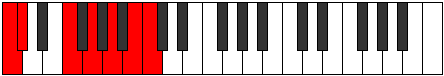

# Scale Katanimic

## Links

- [Documentation](index.md)
- [Scales Index](Scales.md)
- [Modes Index](Modes.md)
- [Chords Index](Chords.md)

## Cardinality

6 Notes

## Perfection

- 2 Perfect Pitch
- 4 Imperfect Pitch
- [false true false false false true] Perfection Profile

## Modes

| Number | Mode | Notes | Illustration | Audio |
|--------|------|-------|--------------|-------|
| [469](https://ianring.com/musictheory/scales/469) | [Katyrimic](ModeKatyrimic.md) | C, **D**, **E**, **F#**, G, **Ab**, C |  | [midi](https://github.com/edipermadi/music/blob/main/docs/ModeCNaturalKatyrimic.mid?raw=true) | 
| [1141](https://ianring.com/musictheory/scales/1141) | [Rynimic](ModeRynimic.md) | **C**, **D**, **E**, F, **Gb**, A#, **C** |  | [midi](https://github.com/edipermadi/music/blob/main/docs/ModeCNaturalRynimic.mid?raw=true) | 
| [1309](https://ianring.com/musictheory/scales/1309) | [Pogimic](ModePogimic.md) | **C**, **D**, Eb, **Fb**, G#, **A#**, **C** |  | [midi](https://github.com/edipermadi/music/blob/main/docs/ModeCNaturalPogimic.mid?raw=true) | 
| [1351](https://ianring.com/musictheory/scales/1351) | [Aeraptimic](ModeAeraptimic.md) | **C**, Db, **Ebb**, F#, **G#**, **A#**, **C** |  | [midi](https://github.com/edipermadi/music/blob/main/docs/ModeCNaturalAeraptimic.mid?raw=true) | 
| [2723](https://ianring.com/musictheory/scales/2723) | [Epylimic](ModeEpylimic.md) | C, **Db**, E#, **F##**, **G##**, **A##**, C |  | [midi](https://github.com/edipermadi/music/blob/main/docs/ModeCNaturalEpylimic.mid?raw=true) | 
| [3409](https://ianring.com/musictheory/scales/3409) | [Katanimic](ModeKatanimic.md) | **C**, D##, **E##**, **F###**, **G###**, A##, **C** |  | [midi](https://github.com/edipermadi/music/blob/main/docs/ModeCNaturalKatanimic.mid?raw=true) | 
