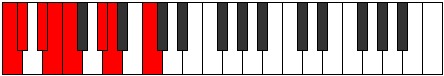
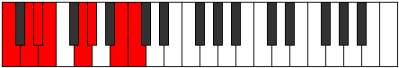

# Scale Katathian

## Links

- [Documentation](index.md)
- [Scales Index](Scales.md)
- [Modes Index](Modes.md)
- [Chords Index](Chords.md)

## Cardinality

7 Notes

## Perfection

- 4 Perfect Pitch
- 3 Imperfect Pitch
- [true true true false true false false] Perfection Profile

## Modes

| Number | Mode | Notes | Illustration | Audio |
|--------|------|-------|--------------|-------|
| [827](https://ianring.com/musictheory/scales/827) | [Mixolocrian](ModeMixolocrian.md) | **C**, Db, **Eb**, **Fb**, Gbb, Ab, Bbb, **C** |  | [midi](ModeCNaturalMixolocrian.mid) [ogg](ModeCNaturalMixolocrian.ogg) | 
| [947](https://ianring.com/musictheory/scales/947) | [Modian](ModeModian.md) | C, Db, **E**, F, **G**, **Ab**, Bbb, C |  | [midi](ModeCNaturalModian.mid) [ogg](ModeCNaturalModian.ogg) | 
| [1639](https://ianring.com/musictheory/scales/1639) | [Aeolothian](ModeAeolothian.md) | **C**, **Db**, Ebb, F, Gb, **A**, Bb, **C** |  | [midi](ModeCNaturalAeolothian.mid) [ogg](ModeCNaturalAeolothian.ogg) | 
| [2461](https://ianring.com/musictheory/scales/2461) | [Sagian](ModeSagian.md) | C, **D**, **Eb**, Fb, G, Ab, **B**, C |  | [midi](ModeCNaturalSagian.mid) [ogg](ModeCNaturalSagian.ogg) | 
| [2521](https://ianring.com/musictheory/scales/2521) | [Barian](ModeBarian.md) | C, **D#**, E, **F#**, **G**, Ab, B, C |  | [midi](ModeCNaturalBarian.mid) [ogg](ModeCNaturalBarian.ogg) | 
| [2867](https://ianring.com/musictheory/scales/2867) | [Socrian](ModeSocrian.md) | **C**, Db, E, F, **G#**, A, **B**, **C** |  | [midi](ModeCNaturalSocrian.mid) [ogg](ModeCNaturalSocrian.ogg) | 
| [3481](https://ianring.com/musictheory/scales/3481) | [Katathian](ModeKatathian.md) | C, D#, E, **F##**, G#, **A#**, **B**, C |  | [midi](ModeCNaturalKatathian.mid) [ogg](ModeCNaturalKatathian.ogg) | 
