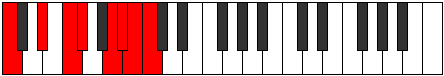

# Scale Katocrian

## Links

- [Documentation](README.md)
- [Scales Index](Scales.md)
- [Modes Index](Modes.md)
- [Chords Index](Chords.md)

## Cardinality

7 Notes

## Perfection

- 4 Perfect Pitch
- 3 Imperfect Pitch
Perfection Profile - false, true, true, false, false, true, true

## Modes

| Number | Mode | Luminosity | Notes | Illustration | Audio |
|--------|------|------------|-------|--------------|-------|
| [847](https://ianring.com/musictheory/scales/847) | [Ganian](ModeGanian.md) | -1 | **C**, Db, Ebb, **Fbb**, Gb, Ab, **Bbb**, **C** |  | [midi](https://github.com/edipermadi/music/blob/main/docs/ModeCNaturalGanian.mid?raw=true) | 
| [973](https://ianring.com/musictheory/scales/973) | [Phryptian](ModePhryptian.md) | 7 | C, D, **Eb**, **F#**, G, Ab, **Bbb**, C |  | [midi](https://github.com/edipermadi/music/blob/main/docs/ModeCNaturalPhryptian.mid?raw=true) | 
| [1267](https://ianring.com/musictheory/scales/1267) | [Katynian](ModeKatynian.md) | -1 | C, **Db**, **E**, F, Gb, **Abb**, Bb, C |  | [midi](https://github.com/edipermadi/music/blob/main/docs/ModeCNaturalKatynian.mid?raw=true) | 
| [2471](https://ianring.com/musictheory/scales/2471) | [Eparian](ModeEparian.md) | 6 | C, Db, **Ebb**, F, G, **Ab**, **B**, C |  | [midi](https://github.com/edipermadi/music/blob/main/docs/ModeCNaturalEparian.mid?raw=true) | 
| [2681](https://ianring.com/musictheory/scales/2681) | [Aerycrian](ModeAerycrian.md) | -1 | **C**, **D#**, E, F, **Gb**, A, B, **C** |  | [midi](https://github.com/edipermadi/music/blob/main/docs/ModeCNaturalAerycrian.mid?raw=true) | 
| [3283](https://ianring.com/musictheory/scales/3283) | [Lyrian](ModeLyrian.md) | 7 | C, **Db**, E, F#, **G**, **A#**, B, C |  | [midi](https://github.com/edipermadi/music/blob/main/docs/ModeCNaturalLyrian.mid?raw=true) | 
| [3689](https://ianring.com/musictheory/scales/3689) | [Katocrian](ModeKatocrian.md) | -1 | **C**, D#, E#, **F#**, **G##**, A#, B, **C** |  | [midi](https://github.com/edipermadi/music/blob/main/docs/ModeCNaturalKatocrian.mid?raw=true) | 
