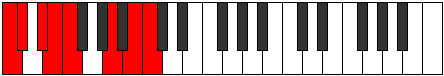

# Scale Katogian

## Links

- [Documentation](index.md)
- [Scales Index](Scales.md)
- [Modes Index](Modes.md)
- [Chords Index](Chords.md)

## Cardinality

7 Notes

## Perfection

- 3 Perfect Pitch
- 4 Imperfect Pitch
- [true true false false false false true] Perfection Profile

## Modes

| Number | Mode | Notes | Illustration | Audio |
|--------|------|-------|--------------|-------|
| [477](https://ianring.com/musictheory/scales/477) | [Stacrian](ModeStacrian.md) | C, **D**, **Eb**, **Fb**, **Gb**, Abb, Bbbb, C |  | [midi](ModeCNaturalStacrian.mid) [ogg](ModeCNaturalStacrian.ogg) | 
| [1143](https://ianring.com/musictheory/scales/1143) | [Styrian](ModeStyrian.md) | **C**, **Db**, **Ebb**, **Fb**, Gbb, Abbb, Bb, **C** |  | [midi](ModeCNaturalStyrian.mid) [ogg](ModeCNaturalStyrian.ogg) | 
| [1863](https://ianring.com/musictheory/scales/1863) | [Pycrian](ModePycrian.md) | **C**, Db, Ebb, F#, **G#**, **A**, **Bb**, **C** |  | [midi](ModeCNaturalPycrian.mid) [ogg](ModeCNaturalPycrian.ogg) | 
| [2619](https://ianring.com/musictheory/scales/2619) | [Ionyrian](ModeIonyrian.md) | **C**, **Db**, **Eb**, Fb, Gbb, A, **B**, **C** |  | [midi](ModeCNaturalIonyrian.mid) [ogg](ModeCNaturalIonyrian.ogg) | 
| [2979](https://ianring.com/musictheory/scales/2979) | [Gyptian](ModeGyptian.md) | C, Db, E#, **F##**, **G#**, **A**, **B**, C |  | [midi](ModeCNaturalGyptian.mid) [ogg](ModeCNaturalGyptian.ogg) | 
| [3357](https://ianring.com/musictheory/scales/3357) | [Phrodian](ModePhrodian.md) | **C**, **D**, Eb, Fb, G#, **A#**, **B**, **C** |  | [midi](ModeCNaturalPhrodian.mid) [ogg](ModeCNaturalPhrodian.ogg) | 
| [3537](https://ianring.com/musictheory/scales/3537) | [Katogian](ModeKatogian.md) | C, D##, **E##**, **F##**, **G#**, **A#**, B, C |  | [midi](ModeCNaturalKatogian.mid) [ogg](ModeCNaturalKatogian.ogg) | 
