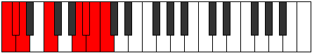

# Scale Katyptian

## Links

- [Documentation](index.md)
- [Scales Index](Scales.md)
- [Modes Index](Modes.md)
- [Chords Index](Chords.md)

## Cardinality

7 Notes

## Perfection

- 3 Perfect Pitch
- 4 Imperfect Pitch
- [true false true false false false true] Perfection Profile

## Modes

| Number | Mode | Notes | Illustration | Audio |
|--------|------|-------|--------------|-------|
| [319](https://ianring.com/musictheory/scales/319) | [Epodian](ModeEpodian.md) | **C**, Db, **Ebb**, **Fbb**, **Gbbb**, D###, F###, **C** |  | [midi](ModeCNaturalEpodian.mid) [ogg](ModeCNaturalEpodian.ogg) | 
| [1009](https://ianring.com/musictheory/scales/1009) | [Katyptian](ModeKatyptian.md) | C, **D##**, E#, **F#**, **G**, **Ab**, Bbb, C |  | [midi](ModeCNaturalKatyptian.mid) [ogg](ModeCNaturalKatyptian.ogg) | 
| [2207](https://ianring.com/musictheory/scales/2207) | [Mygian](ModeMygian.md) | C, **Db**, **Ebb**, **Fbb**, Gbbb, Abb, **B**, C |  | [midi](ModeCNaturalMygian.mid) [ogg](ModeCNaturalMygian.ogg) | 
| [3151](https://ianring.com/musictheory/scales/3151) | [Pacrian](ModePacrian.md) | **C**, **Db**, **Ebb**, Fbb, Gb, **A#**, B, **C** |  | [midi](ModeCNaturalPacrian.mid) [ogg](ModeCNaturalPacrian.ogg) | 
| [3623](https://ianring.com/musictheory/scales/3623) | [Aerocrian](ModeAerocrian.md) | **C**, **Db**, Ebb, F, **G##**, A#, **B**, **C** |  | [midi](ModeCNaturalAerocrian.mid) [ogg](ModeCNaturalAerocrian.ogg) | 
| [3859](https://ianring.com/musictheory/scales/3859) | [Aeolarian](ModeAeolarian.md) | **C**, Db, E, **F###**, G##, **A#**, **B**, **C** |  | [midi](ModeCNaturalAeolarian.mid) [ogg](ModeCNaturalAeolarian.ogg) | 
| [3977](https://ianring.com/musictheory/scales/3977) | [Kythian](ModeKythian.md) | C, D#, **E###**, F###, **G##**, **A#**, **B**, C |  | [midi](ModeCNaturalKythian.mid) [ogg](ModeCNaturalKythian.ogg) | 
