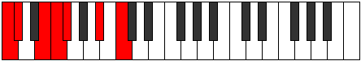

# Scale Katythimic

## Links

- [Documentation](README.md)
- [Scales Index](Scales.md)
- [Modes Index](Modes.md)
- [Chords Index](Chords.md)

## Cardinality

6 Notes

## Perfection

- 3 Perfect Pitch
- 3 Imperfect Pitch
Perfection Profile - true, true, false, false, false, true

## Modes

| Number | Mode | Luminosity | Notes | Illustration | Audio |
|--------|------|------------|-------|--------------|-------|
| [461](https://ianring.com/musictheory/scales/461) | [Madimic](ModeMadimic.md) | 6 | C, **D**, **Eb**, **F#**, G, Ab, C |  | [midi](https://github.com/edipermadi/music/blob/main/docs/ModeCNaturalMadimic.mid?raw=true) | 
| [839](https://ianring.com/musictheory/scales/839) | [Ionathimic](ModeIonathimic.md) | -1 | **C**, Db, Ebb, F#, **G#**, **A**, **C** |  | [midi](https://github.com/edipermadi/music/blob/main/docs/ModeCNaturalIonathimic.mid?raw=true) | 
| [1139](https://ianring.com/musictheory/scales/1139) | [Aerygimic](ModeAerygimic.md) | 4 | **C**, **Db**, **E**, F, Gb, A#, **C** |  | [midi](https://github.com/edipermadi/music/blob/main/docs/ModeCNaturalAerygimic.mid?raw=true) | 
| [2467](https://ianring.com/musictheory/scales/2467) | [Morimic](ModeMorimic.md) | -1 | C, Db, E#, **F##**, **G#**, **A##**, C |  | [midi](https://github.com/edipermadi/music/blob/main/docs/ModeCNaturalMorimic.mid?raw=true) | 
| [2617](https://ianring.com/musictheory/scales/2617) | [Pylimic](ModePylimic.md) | -1 | **C**, **D#**, E, F, G##, **A##**, **C** |  | [midi](https://github.com/edipermadi/music/blob/main/docs/ModeCNaturalPylimic.mid?raw=true) | 
| [3281](https://ianring.com/musictheory/scales/3281) | [Katythimic](ModeKatythimic.md) | 6 | C, D##, **E##**, **F##**, **G###**, A##, C |  | [midi](https://github.com/edipermadi/music/blob/main/docs/ModeCNaturalKatythimic.mid?raw=true) | 
