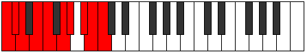

# Scale Koptygic

## Links

- [Documentation](index.md)
- [Scales Index](Scales.md)
- [Modes Index](Modes.md)
- [Chords Index](Chords.md)

## Cardinality

9 Notes

## Perfection

- 6 Perfect Pitch
- 3 Imperfect Pitch
- [false true true true false true false true true] Perfection Profile

## Modes

| Number | Mode | Notes | Illustration | Audio |
|--------|------|-------|--------------|-------|
| [1759](https://ianring.com/musictheory/scales/1759) | [Pylygic](ModePylygic.md) | C, **C#**, D, D#, **E**, F#, G, A, **A#**, C |  | [midi](https://github.com/edipermadi/music/blob/main/docs/ModeCNaturalPylygic.mid?raw=true) | 
| [1787](https://ianring.com/musictheory/scales/1787) | [Mycrygic](ModeMycrygic.md) | C, **C#**, D#, **E**, F, F#, **G**, A, A#, C |  | [midi](https://github.com/edipermadi/music/blob/main/docs/ModeCNaturalMycrygic.mid?raw=true) | 
| [2011](https://ianring.com/musictheory/scales/2011) | [Raphygic](ModeRaphygic.md) | C, C#, D#, **E**, F#, **G**, G#, A, **A#**, C |  | [midi](https://github.com/edipermadi/music/blob/main/docs/ModeCNaturalRaphygic.mid?raw=true) | 
| [2927](https://ianring.com/musictheory/scales/2927) | [Rodygic](ModeRodygic.md) | **C**, C#, D, **D#**, F, F#, G#, **A**, B, **C** |  | [midi](https://github.com/edipermadi/music/blob/main/docs/ModeCNaturalRodygic.mid?raw=true) | 
| [2941](https://ianring.com/musictheory/scales/2941) | [Laptygic](ModeLaptygic.md) | **C**, D, **D#**, E, F, **F#**, G#, A, B, **C** |  | [midi](https://github.com/edipermadi/music/blob/main/docs/ModeCNaturalLaptygic.mid?raw=true) | 
| [3053](https://ianring.com/musictheory/scales/3053) | [Zycrygic](ModeZycrygic.md) | C, D, **D#**, F, **F#**, G, G#, **A**, B, C |  | [midi](https://github.com/edipermadi/music/blob/main/docs/ModeCNaturalZycrygic.mid?raw=true) | 
| [3511](https://ianring.com/musictheory/scales/3511) | [Epolygic](ModeEpolygic.md) | C, C#, **D**, E, F, G, **G#**, A#, **B**, C |  | [midi](https://github.com/edipermadi/music/blob/main/docs/ModeCNaturalEpolygic.mid?raw=true) | 
| [3803](https://ianring.com/musictheory/scales/3803) | [Epidygic](ModeEpidygic.md) | C, **C#**, D#, E, F#, **G**, A, **A#**, B, C |  | [midi](https://github.com/edipermadi/music/blob/main/docs/ModeCNaturalEpidygic.mid?raw=true) | 
| [3949](https://ianring.com/musictheory/scales/3949) | [Koptygic](ModeKoptygic.md) | **C**, D, D#, F, **F#**, G#, **A**, A#, B, **C** |  | [midi](https://github.com/edipermadi/music/blob/main/docs/ModeCNaturalKoptygic.mid?raw=true) | 
