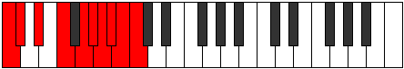

# Scale Kyrygic

## Links

- [Documentation](README.md)
- [Scales Index](Scales.md)
- [Modes Index](Modes.md)
- [Chords Index](Chords.md)

## Cardinality

9 Notes

## Perfection

- 6 Perfect Pitch
- 3 Imperfect Pitch
Perfection Profile - true, true, true, false, true, false, true, false, true

## Modes

| Number | Mode | Luminosity | Notes | Illustration | Audio |
|--------|------|------------|-------|--------------|-------|
| [1407](https://ianring.com/musictheory/scales/1407) | [Tharygic](ModeTharygic.md) | 3 | **C**, C#, **D**, D#, **E**, F, F#, G#, A#, **C** |  | [midi](https://github.com/edipermadi/music/blob/main/docs/ModeCNaturalTharygic.mid?raw=true) | 
| [1533](https://ianring.com/musictheory/scales/1533) | [Katycrygic](ModeKatycrygic.md) | 5 | C, **D**, D#, **E**, F, **F#**, G, G#, A#, C |  | [midi](https://github.com/edipermadi/music/blob/main/docs/ModeCNaturalKatycrygic.mid?raw=true) | 
| [2037](https://ianring.com/musictheory/scales/2037) | [Sythygic](ModeSythygic.md) | 7 | C, D, **E**, F, **F#**, G, **G#**, A, A#, C |  | [midi](https://github.com/edipermadi/music/blob/main/docs/ModeCNaturalSythygic.mid?raw=true) | 
| [2751](https://ianring.com/musictheory/scales/2751) | [Sylygic](ModeSylygic.md) | 8 | C, **C#**, D, **D#**, E, F, G, A, **B**, C |  | [midi](https://github.com/edipermadi/music/blob/main/docs/ModeCNaturalSylygic.mid?raw=true) | 
| [3423](https://ianring.com/musictheory/scales/3423) | [Lothygic](ModeLothygic.md) | -1 | **C**, C#, **D**, D#, E, F#, G#, **A#**, B, **C** |  | [midi](https://github.com/edipermadi/music/blob/main/docs/ModeCNaturalLothygic.mid?raw=true) | 
| [3759](https://ianring.com/musictheory/scales/3759) | [Darygic](ModeDarygic.md) | 6 | C, **C#**, D, D#, F, G, **A**, A#, **B**, C |  | [midi](https://github.com/edipermadi/music/blob/main/docs/ModeCNaturalDarygic.mid?raw=true) | 
| [3927](https://ianring.com/musictheory/scales/3927) | [Monygic](ModeMonygic.md) | -1 | **C**, C#, D, E, F#, **G#**, A, **A#**, B, **C** |  | [midi](https://github.com/edipermadi/music/blob/main/docs/ModeCNaturalMonygic.mid?raw=true) | 
| [4011](https://ianring.com/musictheory/scales/4011) | [Styrygic](ModeStyrygic.md) | 4 | C, C#, D#, F, **G**, G#, **A**, A#, **B**, C |  | [midi](https://github.com/edipermadi/music/blob/main/docs/ModeCNaturalStyrygic.mid?raw=true) | 
| [4053](https://ianring.com/musictheory/scales/4053) | [Kyrygic](ModeKyrygic.md) | 9 | C, D, E, **F#**, G, **G#**, A, **A#**, B, C |  | [midi](https://github.com/edipermadi/music/blob/main/docs/ModeCNaturalKyrygic.mid?raw=true) | 
