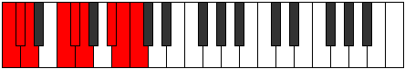

# Scale Locryllic

## Links

- [Documentation](README.md)
- [Scales Index](Scales.md)
- [Modes Index](Modes.md)
- [Chords Index](Chords.md)

## Cardinality

8 Notes

## Perfection

- 6 Perfect Pitch
- 2 Imperfect Pitch
Perfection Profile - false, true, true, true, true, true, true, false

## Modes

| Number | Mode | Luminosity | Notes | Illustration | Audio |
|--------|------|------------|-------|--------------|-------|
| [927](https://ianring.com/musictheory/scales/927) | [Koptyllic](ModeKoptyllic.md) | -1 | C, C#, D, **D#**, **E**, G, G#, A, C |  | [midi](https://github.com/edipermadi/music/blob/main/docs/ModeCNaturalKoptyllic.mid?raw=true) | 
| [999](https://ianring.com/musictheory/scales/999) | [Bylyllic](ModeBylyllic.md) | -1 | C, C#, D, F, F#, G, **G#**, **A**, C |  | [midi](https://github.com/edipermadi/music/blob/main/docs/ModeCNaturalBylyllic.mid?raw=true) | 
| [2511](https://ianring.com/musictheory/scales/2511) | [Epyryllic](ModeEpyryllic.md) | -1 | C, C#, **D**, **D#**, F#, G, G#, B, C |  | [midi](https://github.com/edipermadi/music/blob/main/docs/ModeCNaturalEpyryllic.mid?raw=true) | 
| [2547](https://ianring.com/musictheory/scales/2547) | [Sogyllic](ModeSogyllic.md) | -1 | C, C#, E, F, F#, **G**, **G#**, B, C |  | [midi](https://github.com/edipermadi/music/blob/main/docs/ModeCNaturalSogyllic.mid?raw=true) | 
| [3303](https://ianring.com/musictheory/scales/3303) | [Soptyllic](ModeSoptyllic.md) | 6 | C, **C#**, **D**, F, F#, G, A#, B, C |  | [midi](https://github.com/edipermadi/music/blob/main/docs/ModeCNaturalSoptyllic.mid?raw=true) | 
| [3321](https://ianring.com/musictheory/scales/3321) | [Ionycryllic](ModeIonycryllic.md) | -1 | C, D#, E, F, **F#**, **G**, A#, B, C |  | [midi](https://github.com/edipermadi/music/blob/main/docs/ModeCNaturalIonycryllic.mid?raw=true) | 
| [3699](https://ianring.com/musictheory/scales/3699) | [Aeolylyllic](ModeAeolylyllic.md) | -1 | **C**, **C#**, E, F, F#, A, A#, B, **C** |  | [midi](https://github.com/edipermadi/music/blob/main/docs/ModeCNaturalAeolylyllic.mid?raw=true) | 
| [3897](https://ianring.com/musictheory/scales/3897) | [Locryllic](ModeLocryllic.md) | 4 | **C**, D#, E, F, G#, A, A#, **B**, **C** |  | [midi](https://github.com/edipermadi/music/blob/main/docs/ModeCNaturalLocryllic.mid?raw=true) | 
