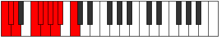

# Scale Loptygic

## Links

- [Documentation](README.md)
- [Scales Index](Scales.md)
- [Modes Index](Modes.md)
- [Chords Index](Chords.md)

## Cardinality

9 Notes

## Perfection

- 7 Perfect Pitch
- 2 Imperfect Pitch
Perfection Profile - true, true, true, true, false, false, true, true, true

## Modes

| Number | Mode | Luminosity | Notes | Illustration | Audio |
|--------|------|------------|-------|--------------|-------|
| [959](https://ianring.com/musictheory/scales/959) | [Katylygic](ModeKatylygic.md) | -1 | C, C#, D, **D#**, **E**, F, G, G#, A, C |  | [midi](https://github.com/edipermadi/music/blob/main/docs/ModeCNaturalKatylygic.mid?raw=true) | 
| [2023](https://ianring.com/musictheory/scales/2023) | [Zodygic](ModeZodygic.md) | 7 | C, C#, D, F, F#, G, **G#**, **A**, A#, C |  | [midi](https://github.com/edipermadi/music/blob/main/docs/ModeCNaturalZodygic.mid?raw=true) | 
| [2527](https://ianring.com/musictheory/scales/2527) | [Phradygic](ModePhradygic.md) | -1 | C, C#, **D**, **D#**, E, F#, G, G#, B, C |  | [midi](https://github.com/edipermadi/music/blob/main/docs/ModeCNaturalPhradygic.mid?raw=true) | 
| [3059](https://ianring.com/musictheory/scales/3059) | [Madygic](ModeMadygic.md) | 8 | C, C#, E, F, F#, **G**, **G#**, A, B, C |  | [midi](https://github.com/edipermadi/music/blob/main/docs/ModeCNaturalMadygic.mid?raw=true) | 
| [3311](https://ianring.com/musictheory/scales/3311) | [Mixodygic](ModeMixodygic.md) | -1 | C, **C#**, **D**, D#, F, F#, G, A#, B, C |  | [midi](https://github.com/edipermadi/music/blob/main/docs/ModeCNaturalMixodygic.mid?raw=true) | 
| [3577](https://ianring.com/musictheory/scales/3577) | [Loptygic](ModeLoptygic.md) | -1 | C, D#, E, F, **F#**, **G**, G#, A#, B, C |  | [midi](https://github.com/edipermadi/music/blob/main/docs/ModeCNaturalLoptygic.mid?raw=true) | 
| [3703](https://ianring.com/musictheory/scales/3703) | [Katalygic](ModeKatalygic.md) | 7 | **C**, **C#**, D, E, F, F#, A, A#, B, **C** |  | [midi](https://github.com/edipermadi/music/blob/main/docs/ModeCNaturalKatalygic.mid?raw=true) | 
| [3899](https://ianring.com/musictheory/scales/3899) | [Katorygic](ModeKatorygic.md) | 4 | **C**, C#, D#, E, F, G#, A, A#, **B**, **C** |  | [midi](https://github.com/edipermadi/music/blob/main/docs/ModeCNaturalKatorygic.mid?raw=true) | 
| [3997](https://ianring.com/musictheory/scales/3997) | [Dogygic](ModeDogygic.md) | -1 | C, D, D#, E, G, G#, A, **A#**, **B**, C |  | [midi](https://github.com/edipermadi/music/blob/main/docs/ModeCNaturalDogygic.mid?raw=true) | 
