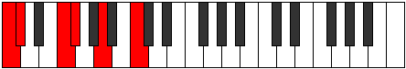

# Scale Lycritonic

## Links

- [Documentation](README.md)
- [Scales Index](Scales.md)
- [Modes Index](Modes.md)
- [Chords Index](Chords.md)

## Cardinality

5 Notes

## Perfection

- 2 Perfect Pitch
- 3 Imperfect Pitch
Perfection Profile - false, true, true, false, false

## Modes

| Number | Mode | Luminosity | Notes | Illustration | Audio |
|--------|------|------------|-------|--------------|-------|
| [403](https://ianring.com/musictheory/scales/403) | [Daptitonic](ModeDaptitonic.md) | -1 | C, C#, **E**, **G**, **G#**, C |  | [midi](https://github.com/edipermadi/music/blob/main/docs/ModeCNaturalDaptitonic.mid?raw=true) | 
| [611](https://ianring.com/musictheory/scales/611) | [Zynitonic](ModeZynitonic.md) | 4 | **C**, **C#**, F, F#, **A**, **C** |  | [midi](https://github.com/edipermadi/music/blob/main/docs/ModeCNaturalZynitonic.mid?raw=true) | 
| [793](https://ianring.com/musictheory/scales/793) | [Mocritonic](ModeMocritonic.md) | -1 | **C**, **D#**, **E**, G#, A, **C** |  | [midi](https://github.com/edipermadi/music/blob/main/docs/ModeCNaturalMocritonic.mid?raw=true) | 
| [2249](https://ianring.com/musictheory/scales/2249) | [Kygitonic](ModeKygitonic.md) | -1 | C, **D#**, **F#**, **G**, B, C |  | [midi](https://github.com/edipermadi/music/blob/main/docs/ModeCNaturalKygitonic.mid?raw=true) | 
| [2353](https://ianring.com/musictheory/scales/2353) | [Lycritonic](ModeLycritonic.md) | 4 | **C**, E, F, **G#**, **B**, **C** |  | [midi](https://github.com/edipermadi/music/blob/main/docs/ModeCNaturalLycritonic.mid?raw=true) | 
